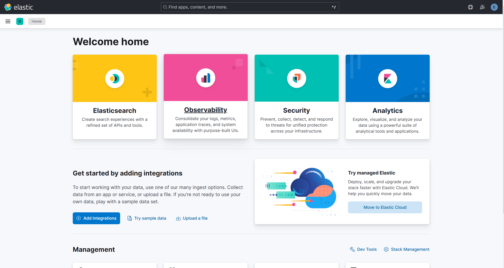

# elk stack 설치 및 실행

<br>

## elk stack 설치 (리눅스 Debian)
```bash
wget -qO - https://artifacts.elastic.co/GPG-KEY-elasticsearch | sudo gpg --dearmor -o /usr/share/keyrings/elasticsearch-keyring.gpg
gpg --show-keys /usr/share/keyrings/elasticsearch-keyring.gpg
sudo apt-get install apt-transport-https
echo "deb [signed-by=/usr/share/keyrings/elasticsearch-keyring.gpg] https://artifacts.elastic.co/packages/8.x/apt stable main" | sudo tee /etc/apt/sources.list.d/elastic-8.x.list
sudo apt-get update && sudo apt-get install elasticsearch
sudo apt-get install kibana
sudo apt-get install logstash

# 비트 사용시 원하는 비트를 지정하여 설치 
sudo apt-get install <beat>
sudo apt-get install filebeat
sudo apt-get install metricbeat
```

<br>

## 엘라스틱서치 실행 확인

```bash
sudo systemctl daemon-reload
```
데몬 로딩

<br>

```bash
sudo systemctl enable elasticsearch
```
elasticsearch 서비스 활성화

<br>

```bash
sudo systemctl start elasticsearch
sudo systemctl stop elasticsearch
```
엘라스틱서치 시작하거나 중지(키바나도 마찬가지)

<br>

```bash
sudo curl --cacert /etc/elasticsearch/certs/http_ca.crt -u elastic https://localhost:9200
```
엘라스틱서치가 실행중인지 확인
```bash
Enter host password for user 'elastic':
{
  "name" : "DESKTOP-L9BQF29",
  "cluster_name" : "elasticsearch",
  "cluster_uuid" : "U5VnR5IbTnO14BPGeqUu9g",
  "version" : {
    "number" : "8.18.3",
    "build_flavor" : "default",
    "build_type" : "deb",
    "build_hash" : "28fc77664903e7de48ba5632e5d8bfeb5e3ed39c",
    "build_date" : "2025-06-18T22:08:41.171261054Z",
    "build_snapshot" : false,
    "lucene_version" : "9.12.1",
    "minimum_wire_compatibility_version" : "7.17.0",
    "minimum_index_compatibility_version" : "7.0.0"
  },
  "tagline" : "You Know, for Search"
}
```
결과

<br>

참고로..
- 비번은 Elasticsearch 설치 완료 후 출력 메시지에 이렇게 표시 됨
```bash
The generated password for the elastic built-in superuser is : ZzmXbvfcLY*W1aVCHpCv
```
- 그러면 비밀번호는 `ZzmXbvfcLY*W1aVCHpCv` 이다

<br><br>

클러스터 상태 진단 API를 사용해 엘라스틱서치 인스턴스의 상태가 'green'이고 할당되지 않은 샤드가 없는지 확인할 수도 있다
```bash
sudo curl --cacert /etc/elasticsearch/certs/http_ca.crt -u elastic https://localhost:9200/_cluster/health
```
결과는 다음과 같다
```bash
{
    "cluster_name":"elasticsearch",
    "status":"green",
    "timed_out":false,
    "number_of_nodes":1,
    "number_of_data_nodes":1,
    "active_primary_shards":3,
    "active_shards":3,
    "relocating_shards":0,
    "initializing_shards":0,
    "unassigned_shards":0,
    "unassigned_primary_shards":0,
    "delayed_unassigned_shards":0,
    "number_of_pending_tasks":0,
    "number_of_in_flight_fetch":0,
    "task_max_waiting_in_queue_millis":0,
    "active_shards_percent_as_number":100.0
}
```

<br>

## 키바나 실행 확인

키바나 틍록 토큰 생성
```bash
sudo /usr/share/elasticsearch/bin/elasticsearch-create-enrollment-token -s kibana
```
- 생성된 토큰은 복사
- 웹 브라우저 `localhost:5601`로 이동
    1. 생성된 토큰 붙여넣기
    2. 확인 코드 붙여 넣기
        - 확인코드는
        ```bash
        sudo journalctl -u kibana.service -f
        ```
        - Kibana가 실행 중인 터미널 또는 로그 파일을 찾거나, 다음과 같이 명령어를 치면 나온다
    3. 아이디, 비번 적기
        - 기본 아이디는 `elastic`, 기본 비번은 설치 완료했을때 콘솔에 자동 생성되어 출력한 비번 `ZzmXbvfcLY*W1aVCHpCv`

<br>

키바나가 제대로 실행된다면 다음과 같은 홈페이지가 나옴



<br><br><br>

> 출처: &nbsp;&nbsp; _"시작하세요! 엘라스틱 스택 8"_ 