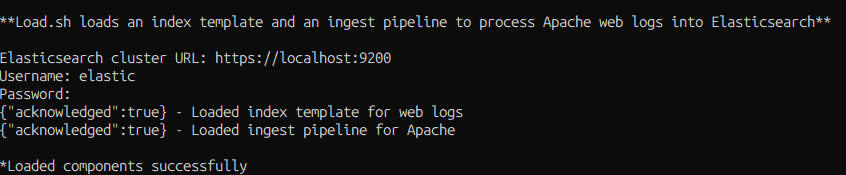

# 예제 코드

<br>

## 샘플 로그 받기
1. 4개 파일 생성
```sh
#!/bin/bash
printf "\n**Load.sh loads an index template and an ingest pipeline to process Apache web logs into Elasticsearch**\n\n"
echo -n "Elasticsearch cluster URL: "
read url
echo -n "Username: "
read username
echo -n "Password: "
read -s password
echo

# load index template
if curl -k -f -XPUT "$url/_index_template/web-logs" -u $username:$password -H 'Content-Type: application/json' -d "@web-logs-template.json"
then echo " - Loaded index template for web logs"
else echo " Could not load index template"
exit
fi

# load ingest pipeline
if curl -k -f -XPUT "$url/_ingest/pipeline/web-logs" -u $username:$password -H 'Content-Type: application/json' -d "@web-logs-pipeline.json"
then echo " - Loaded ingest pipeline for Apache"
else echo " Could not load ingest pipeline for Apache"
exit
fi

printf "\n*Loaded components successfully\n"
```
load.sh

<br>

```sh
https://github.com/wikibook/es80/tree/main/Chapter3
```
- 해당 주소에서 `web-logs-template.json`, `web-logs-pipeline.json`, `web.log` 다운

<br><br>

2. 같은 폴더에 위 4개의 파일을 생성시킨 후 `./load.sh` 실행
- url은 `https://localhost:9200`
    - `/etc/elasticsearch/elasticsearch.yml`에 아래 항목이 있다면 `https://`로 접속
    ```sh
    xpack.security.http.transport.enabled: true
    ``` 

<br>

아래와 같은 결과가 나오면 성공



<br><br>

3. 로그스태시 다운
```sh
curl -O https://artifacts.elastic.co/downloads/logstash/logstash-8.14.0-linux-x86_64.tar.gz
```
다운로드가 완료되면 .tar 아카이브 파일의 압축을 푼다
```sh
tar -xzf logstash-8.14.0-linux-x86_64.tar.gz
```

<br><br>

4. `web-logs-logstash.conf` 파일 환경설정
```sh
input {
    stdin {}
}

filter {
  mutate {
    remove_field => ["host", "@version"]
  }
}

output {
  stdout {
    codec => dots {}
  }

  elasticsearch {
    hosts => "https://localhost:9200"
    user => "elastic"
    password => "<password>"
    index => "web-logs"
    pipeline => "web-logs"
    ssl_certificate_verification => false
  }
}
```
- hosts, user, password에 알맞은 값을 넣는다

<br><br>

5. 로그스태시를 실행해 데이터를 인제스트 한다
```
/usr/share/logstash/bin/logstash -f ~/경로/web-logs-logstash.conf < web.log --path.settings /etc/logstash
```

<br><br>

6. 엘라스틱서치에서 데이터를 사용할 수 있는지 확인한다
```
GET web-logs/_cout
GET web-logs/_search
```

<br><br>

## 데이터 색인과 검색
```json
PUT /my-index
GET my-index
GET _cat/indices
PUT my-other-index
PUT my-other-index2
{
  "settings": {
    "index": {
      "number_of_shards": 3,
      "number_of_replicas": 1
    }
  }
}
GET _cat/shards/my-other-index2?v
PUT my-index/_doc/2
{
  "city": "Japan"
}
GET my-index/_search
POST my-index/_doc/
{
  "city": 11.1
}
GET my-index/_mapping
PUT my-explicit-index
{
  "mappings": {
    "properties": {
      "year": {
        "type": "integer"
      },
      "city": {
        "type": "keyword"
      },
      "population_M": {
        "type": "float"
      },
      "attrations": {
        "type": "text"
      }
    }
  }
}
POST my-explicit-index/_doc
{
  "year": "aa",
  "city": "AA",
  "population_M":2.0,
  "attrations": "Queen"
}

GET my-explicit-index/_search

PUT stores
{
  "mappings": {
    "properties": {
      "suburb": {
        "type": "keyword"
      },
      "product": {
        "type": "nested"
      }
    }
  }
}

POST stores/_doc
{
  "suburb": "Carlton",
  "product": [
    {
      "product": "i20 Hatch",
      "quantity":21
    },
    {
      "product": "i30 Sport",
      "quantity":300
    }
  ]
}

GET stores/_search
{
  "query": {
    "nested": {
      "path": "product",
      "query": {
        "bool": {
          "must": [
            {"match": {"product.product.keyword": "i30 Sport"}}
          ]
        }
      }
    }
  }
}

PUT department-employees
{
  "mappings": {
    "properties": {
      "dept_id": { "type": "keyword"},
      "dept_name": {"type": "keyword"},
      "employee_id": {"type": "keyword"},
      "employee_name": {"type": "keyword"},
      "doc_type": {
        "type": "join",
        "relations": {
          "department": "employee"
        }
      }
    }
  }
}

PUT department-employees/_doc/d3
{
  "dept_id": "D003",
  "dept_name": "IT",
  "doc_type": "department"
}

PUT department-employees/_doc/e1?routing=1
{
  "employee_id": "E002",
  "employee_name": "James",
  "doc_type": {
    "name": "employee",
    "parent": "d3"
  }
}

PUT department-employees/_doc/e2?routing=1
{
  "employee_id": "E003",
  "employee_name": "Sara",
  "doc_type": {
    "name": "employee",
    "parent": "d3"
  }
}

GET department-employees/_search
{
  "query": {
    "has_parent": {
      "parent_type": "department",
      "query": {
        "term": {
          "dept_name": {
            "value": "IT"
          }
        }
      }
    }
  }
}
```

<br>

## 데이터 분석 관리
```json
GET web-logs/_search?size=0
{
  "query": {
    "range": {
      "@timestamp": {
        "gte": "2019-01-23T00:00:00.000Z",
        "lte": "2019-01-24T00:00:00.000Z"
      }
    }
  }
}

GET web-logs/_search?size=0
{
  "query": {
    "range": {
      "@timestamp": {
        "gte": "2019-01-23T00:00:00.000Z",
        "lte": "2019-01-24T00:00:00.000Z"
      }
    }
  },
  "aggs": {
    "bytes_served": {
      "sum": {
        "field": "http.response.body.bytes"
      }
    }
  }
}

GET web-logs/_search?size=0
{
  "query": {
    "range": {
      "@timestamp": {
        "gte": "2019-01-23T00:00:00.000Z",
        "lte": "2019-01-24T00:00:00.000Z"
      }
    }
  },
  "aggs": {
    "hourly": {
      "date_histogram": {
        "field": "@timestamp",
        "fixed_interval": "1h"
      },
      "aggs": {
        "bytes_served": {
          "sum": {
            "field": "http.response.body.bytes"
          }
        }
      }
    }
  }
}

GET web-logs/_search?size=0
{
  "query": {
    "range": {
      "@timestamp": {
        "gte": "2019-01-23T00:00:00.000Z",
        "lte": "2019-01-24T00:00:00.000Z"
      }
    }
  },
  "aggs": {
    "hourly": {
      "date_histogram": {
        "field": "@timestamp",
        "fixed_interval": "1h"
      },
      "aggs": {
        "bytes_served": {
          "sum": {
            "field": "http.response.body.bytes",
            "script": {"source": "_value/(1024)"}
          }
        }
      }
    }
  }
}

GET web-logs/_search?size=0
{
  "query": {
    "range": {
      "@timestamp": {
        "gte": "2019-01-23T00:00:00.000Z",
        "lte": "2019-01-24T00:00:00.000Z"
      }
    }
  },
  "aggs": {
    "hourly": {
      "date_histogram": {
        "field": "@timestamp",
        "fixed_interval": "1h"
      },
      "aggs": {
        "user_agents": {
          "terms": {
            "field": "user_agent.name",
            "size": 5
          }
        },
        "bytes_served": {
          "sum": {
            "field": "http.response.body.bytes",
            "script": {"source": "_value/(1024)"}
          }
        }
      }
    }
  }
}

PUT _ilm/policy/logs-policy
{
  "policy": {
    "phases": {
      "hot": {
        "actions": {
          "rollover": {
            "max_age": "30d",
            "max_size": "50gb"
          }
        }
      },
      "warm": {
        "min_age": "1d",
        "actions": {}
      },
      "delete": {
        "min_age": "10d",
        "actions": {}
      }
    }
  }
}

PUT _index_template/web-logs
{
  "index_patterns": ["ilm-web-logs*"],
  "template": {
    "settings": {
      "number_of_shards": 1,
      "number_of_replicas": 1,
      "index.lifecycle.name": "log-policy",
      "index.lifecycle.rollover_alias": "lim-web-logs"
    }
  }
}

PUT ilm-web-logs-000001
{
  "aliases": {
    "ilm-web-logs": {
      "is_write_index": true
    }
  }
}

POST ilm-web-logs/_doc
{
  "timestamp": "2021-02-14T00:00:000Z",
  "log": "server is up"
}

POST ilm-web-logs/_rollover

GET _cat/indices/ilm-web-logs*?v

GET ilm-web-logs*/_search

PUT /_index_template/log-datastream
{
  "priority": 200,
  "index_patterns": ["logs-datastream"],
  "data_stream": {},
  "template": {
    "settings": {
      "index.lifecycle.name": "logs-policy"
    }
  }
}

PUT /_data_stream/logs-datastream-web-server

GET /_data_stream/logs-datastream-web-server

PUT _ingest/pipeline/logs-add-tag
{
  "description": "Adds a startic tag for the environment the log originates from",
  "processors": [
    {
      "set": {
        "field": "environment",
        "value": "production"
      }
    }
  ]
}

POST _ingest/pipeline/logs-add-tag/_simulate
{
  "docs": [
    {
      "_source": {
        "host.os": "macOS",
        "source.ip": "10.22.11.89"
      }
    }
  ]
}

POST log-index/_doc?pipeline=logs-add-tag
{
  "host.os": "windows 10",
  "source.ip": "113.121.143.90"
}

// 왜 안될까
//POST _bulk
//{ "index": {"_index": "log-index", "_id": "1", "pipeline": "logs-add-tag"}}
//{ "host.os": "windows 7", "source.ip": "10.0.0.1"}

PUT log-index/_settings
{
  "index.default_pipeline": "logs-add-tag"
}

POST log-index/_doc/
{
  "host.os": "linux",
  "source.ip": "10.10.10.1"
}

GET log-index/_search

POST _ingest/pipeline/_simulate
{
  "docs": [
    {
      "_source": {
        "message": "10:12:05 HTTP Monitor production is in GREEN state"
      }
    },
    {
      "_source": {
        "message": "10:12:05 HTTP Monitor production is in RED state"
      }
    }
    ], 
  "pipeline": {
    "processors": [
      {
        "dissect": {
          "field": "message",
          "pattern": "%{time} HTTP Monitor %{monitor.name} is in %{monitor.state} state"
        }
      },
      {
        "lowercase": {
          "field": "monitor.state"
        }
      },
      {
        "remove": {
          "field": "message"
        }
      }
    ]
  }
}

POST _ingest/pipeline/_simulate
{
  "docs": [
    {
      "_source": {
        "environment": "production",
        "subnet": "CTS-01",
        "classification": "secret"
      }
    },
    {
      "_source": {
        "environment": "production",
        "subnet": "ATT-01",
        "classification": "unclassified"
      }
    }
    ], 
  "pipeline": {
    "processors": [
      {
        "set": {
          "if": "ctx.classification=='secret' && ctx.subnet=='CTS-01'", 
          "field": "tag",
          "value": "protected"
        }
      }
    ]
  }
}

POST _ingest/pipeline/_simulate
{
  "docs": [
    {
      "_source": {
        "environment": "production",
        "subnet": "CTS-01",
        "event_code": "AS-32"
      }
    },
    {
      "_source": {
        "environment": "production",
        "subnet": "ATT-01",
        "event_code": "AS-29"
      }
    }
    ], 
  "pipeline": {
    "processors": [
      {
        "script": {
          "source": """
          def disallowedCodes = ["AS-29", "BA-23", "BA-24"];
          if (disallowedCodes.contains(ctx.event_code)){
            ctx.tag = "drop";
          }
          """
        }
      },
      {
        "drop": {
          "if": "ctx.tag == 'drop'"
        }
      }
    ]
  }
}

POST _ingest/pipeline/_simulate
{
  "docs": [
    {
      "_source": {
        "message": "Customer A1121 paid with 5555555555554444"
      }
    },
    {
      "_source": {
        "message": "Customer A1122 paid with 378282246310005"
      }
    }
    ], 
  "pipeline": {
    "processors": [
      {
        "gsub": {
          "field": "message",
          "pattern": "\\b(?:3[47]\\d|(?:4\\d|5[1-5]|65)\\d{2}|6011)\\d{12}\\b",
          "replacement": "xxxx-xxxx-xxxx-xxxx"
        }
      }
    ]
  }
}

PUT sensors
{
  "mappings": {
    "properties": {
      "sensor.id": {
        "type": "keyword"
      },
      "sensor.type":{
        "type": "keyword"
      },
      "sensor.location": {
        "type": "geo_point"
      }
    }
  }
}

POST sensors/_doc/
{
  "sensor.id": "ANZ3431",
  "sensor.type": "humidity",
  "sensor.location": "-37.938009, 144.923652"
}

POST sensors/_doc/
{
  "sensor.id": "ANZ3231",
  "sensor.type": "temperature",
  "sensor.location": "-35.409301, 131.196086"
}

PUT _enrich/policy/sensors-lookup
{
  "match": {
    "indices": "sensors",
    "match_field": "sensor.id",
    "enrich_fields": ["sensor.type", "sensor.location"]
  }
}

POST _enrich/policy/sensors-lookup/_execute

POST _ingest/pipeline/_simulate
{
  "docs": [
    { "_source": {
        "@timestamp": "2019-01-23T00:00:00.000Z",
        "sensor": {
          "id": "ANZ3431",
          "reading": "120"
        }
      }},
    { "_source": {
        "@timestamp": "2019-01-23T00:00:00.000Z",
        "sensor": {
          "id": "AMR1211",
          "reading": "110"
        }
      }}
  ],
  "pipeline": { "processors": [
      {
        "enrich": {
          "policy_name": "sensors-lookup",
          "field": "sensor.id",
          "target_field": "sensor.meta"
        }
      }
    ]
  }}

POST _ingest/pipeline/_simulate 
{ 
  "docs": [ 
    { 
      "_source": { 
        "source_ip": "194.121.12.154" 
      } 
    } 
    ],  
  "pipeline": { 
    "processors": [ 
      { 
        "geoip": { 
          "field": "source_ip", 
          "target_field": "source.geo" 
        } 
      }, 
      { 
        "rename": { 
          "field": "source_ip", 
          "target_field": "source.ip" 
        } 
      } 
    ] 
  } 
} 
```