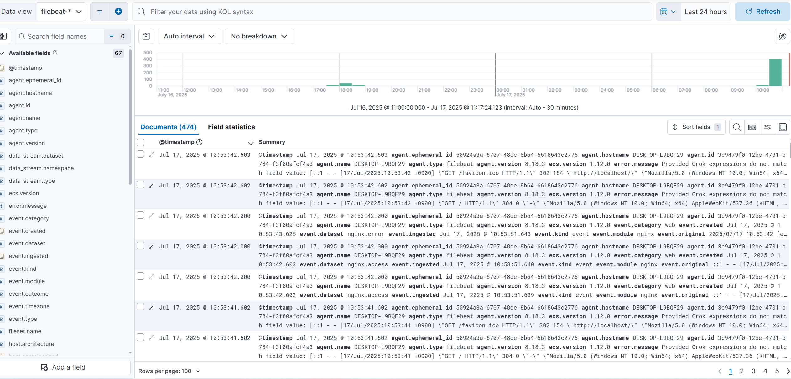

# beats
다양한 시스템에서 데이터를 수집하여 Logstash 또는 Elasticsearch로 전송하는 경량 데이터 수집기

<br>

### 비트 종류
**파일비트(Filebeat)** : 로그 파일 수집 (예: Nginx, Apache, 시스템 로그 등)  
**매트릭비트(Metricbeat)** : 시스템/서비스의 메트릭 수집 (CPU, 메모리, 디스크 등)  
**오딧비트(Auditbeat)** : 이용한 시스템 감사와 보안 이벤트 수집  
**하트비트(Heartbeat)** : 서비스 구동 시간과 가용성 모니터링  
**패킷비트(Packetbeat)** : 이용한 네트워크 트래픽 데이터 수집 

<br>

### 파일 비트 예시
`/etc/filebeat`폴더의 `filebeat.yml`
```
# ============================== Filebeat inputs ===============================

filebeat.inputs:

- type: filestream
  id: my-filestream-id
  enabled: false
  paths:
    - /var/log/*.log
# ============================== Filebeat modules ==============================

filebeat.config.modules:
  # Glob pattern for configuration loading
  path: ${path.config}/modules.d/*.yml

# ---------------------------- Elasticsearch Output ----------------------------
output.elasticsearch:
  # Array of hosts to connect to.
  hosts: ["localhost:9200"]

  # Protocol - either `http` (default) or `https`.
  #protocol: "https"

  username: "elastic"
  password: "changeme"

# ================================= Processors =================================

processors:
  - add_host_metadata: ~
  - add_cloud_metadata: ~
```

<br>

nginx 모듈을 활성화하고 수집한 로그 파일을 구성
```sh
filebeat modules enable nginx
```

<br>

파일이 있는지 확인
```sh
# nginx.yml의 설정이 모두 true여야 함
ls -lah /etx/filebeat/modules.d/nginx.yml
```

<br>

NGINX 로그 수집 모듈을 활성화하고, Kibana에 시각화 대시보드와 Elasticsearch 파이프라인까지 자동으로 구성하는 명령어
```sh
sudo filebeat setup -E "setup.kibana.host=localhost:5601" -M "nginx.access.enabled=true" -M "nginx.error.enabled=true" --dashboards --pipelines
```

<br>

파일비트 서비스 구동
```sh
sudo systemctl start filebeat
```

<br><br>

결과

