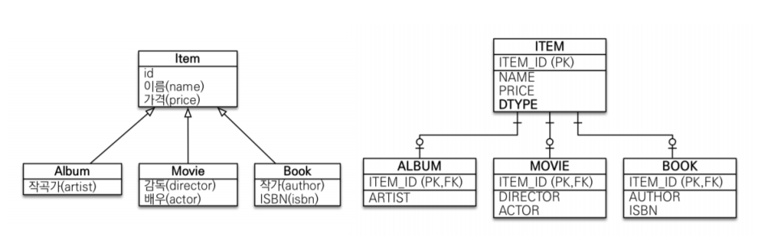
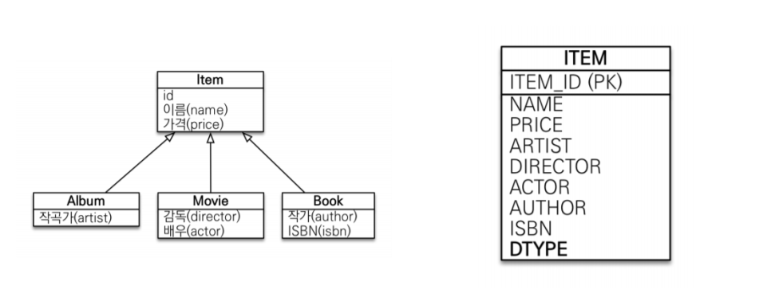
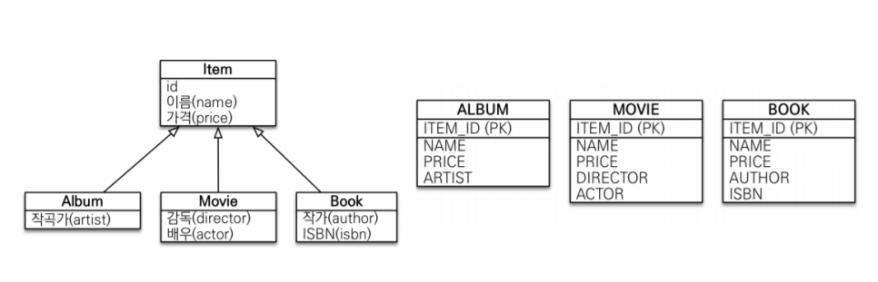
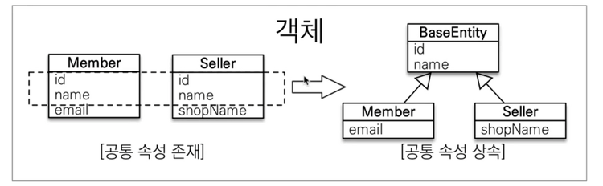
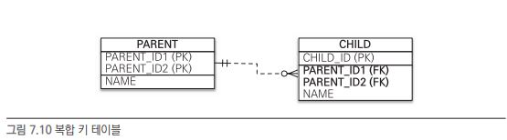

# 고급 매핑

<br>

## 상속 관계 매핑
객체의 상속 관계를 데이터베이스에 어떻게 매핑하는지 다룬다

- **각각의 테이블로 변환**: 부모, 자식 모두 테이블로 만들고 조회할 때 조인을 사용한다
- **통합 테이블로 변환**: 테이블 하나만을 사용해서 통합한다
- **서브타입 테이블로 변환**: 서브 타입마다 하나의 테이블로 만든다

<br>

### 조인 전략


<br>

조인전략 예시
```java
@Entity
@Inheritance(strategy = InheritanceType.JOINED) // 상속 매핑은 부모 클래스에 @Inheritance를 사용, 조인 전략은 JOINED
@DiscriminatorColumn(name = "DTYPE") // 부모 클래스에 구분 컬럼을 지정
public abstract class Item {

    @Id @GeneratedValue
    @Column(name = "ITEM_ID")
    private Long id;
    
    private String name;
    ...
}

@Entity
@DiscriminatorValue("A") // 엔티티를 저장할 때 구분 컬럼에 입력할 값을 지정
public class Album extends Item {

    private String artist;
    ...
}

@Entity
@DiscriminatorValue("B")
@PrimaryKeyJoinColumn(name = "BOOK_ID") // ID 재정의
public class Book extends Item {

    private String author;
    private String isbn;

}
```
장점
- 테이블이 정규화 된다
- 외래 키 참조 무결성 제약조건 활용
- 저장공간을 효율적으로 사용

단점
- 조회할때 조인이 많이 사용되므로 성능 저하
- 조회 쿼리 복잡
- 데이터를 등록할 INSERT SQL을 두 번 실행

<br>

### 단일 테이블 전략


<br>

단일 테이블 전략 예시
```java
@Entity
@Inheritance(strategy = InheritanceType.SINGLE_TABLE)
@DiscriminatorColumn(name = "DTYPE")
public abstract class Item {

    @Id @GeneratedValue
    @Column(name = "ITEM_ID")
    private Long id;
    
    private String name;
    ...
}

@Entity
@DiscriminatorValue("A")
public class Album extends Item { ... }

@Entity
@DiscriminatorValue("M")
public class Movie extends Item { ... }

@Entity
@DiscriminatorValue("B")
public class Book extends Item { ... }
```
장점
- 조인이 필요 없으므로 일반적으로 조회 성능이 빠르다
- 조회 쿼리가 단순하다

단점
- 자식 엔티티가 매핑한 컬럼은 모두 null을 허용해야 한다
- 단일 테이블에 모든 것을 저장하므로 테이블이 커질 수 있다. 그러므로 상황에 따라서는 조회 성능이 오히려 느려질 수 있다

<br>

**_구분 컬럼을 꼭 사용해야 한다_**

<br>

### 서브타입 테이블 전략


<br>

서브타입 테이블 전략 예시
```java
@Entity
@Inheritance(strategy = InheritanceType.TABLE_PER_CLASS)
public abstarct class Item {

    @Id @GeneratedValue
    @Column(name = "ITEM_ID")
    private Long id;

    private String name;
    ...
}

@Entity
public class Album extends Item { ... }

@Entity
public class Movie extends Item { ... }

@Entity
public class Book extends Item { ... }
```

장점
- 서브 타입을 구분해서 처리할 때 효과적이다
- not null 제약조건을 사용할 수 있다

단점
- 여러 자식 테이블을 함께 조회할 때 성능이 느리다
- 자식 테이블을 통합해서 쿼리하기 어렵다

<br>

_이 전략은 추천하지 않는 전략이므로 조인이나 단일 테이블 전략을 고려하는게 좋다_

<br><br>

## @MappedSuperclass


예시
```java
@MappedSuperClass
public abstract class BaseEntity {

    @Id @GeneratedValue
    private Long id;
    private String name;
    ...
}

@Entity
public class Member extends BaseEntity {

    // ID 상속
    // NAME 상속
    private String email;
    ...
}

@Entity
public class Seller extends BaseEntity {

    // ID 상속
    // NAME 상속
    private String shopName;
    ...
}
```
- 테이블과 매핑되지 않고 자식 클래스에 엔티티 매핑 정보를 상속하기 위해 사용
- @MappedSuperclass로 지정한 클래스는 엔티티가 아니므로 em.find() JPQL 사용 X
- 직접 생성해서 사용할 일은 거의 없으므로 추상 클래스로 만드는 것을 권장

<br>

부모로부터 물려받은 매핑 정보를 재정의하려면?
```java
@Entity
@AttributeOverride(name = "id", column = @Column(name = "MEMBER_ID")) // 부모로부터 물려받은 매핑정보 재정의
public class Member extends BaseEntity { ... }
```

<br><br>

## 복합 키와 식별 관계 매핑

식별관계
- 부모 테이블의 기본 키를 내려받아서 자식 테이블의 기본키 + 외래키로 사용하는 관계  

비식별관계
- 부모 테이블의 기본 키를 받아서 자식 테이블의 외래 키로만 사용하는 관계
    - 필수적 비식별 관계: 외래키에 null을 허용하지 않는다
    - 선택적 비식별 관계: 외래키에 null을 허용한다

<br>

### 복합키: 비식별 관계 매핑



<br>

#### `@IdClass`
부모 클래스
```java
@Entity
@IdClass(ParentId.class)
public class Parent {

    @Id
    @Column(name = "PARENT_ID1")
    private String id1;

    @Id
    @Column(name = "PARENT_ID2")
    private String id2;

    private String name;
    ...
}
```

<br>

식별자 클래스
```java
public class ParentId implements Serializable {

    private String id1;
    private String id2;

    public ParentId() {

    }

    public ParentId(String id1, Stirng id2) {
        this.id1;
        this.id2;
    }

    @Override
    public boolean equals(Object o) {...}

    @Override
    public int hashCode() {...}
}
```
- 식별자 클래스의 속성명과 엔티티에서 사용하는 식별자의 속성명이 같아야 한다
- Serializable 인터페이스 구현
- equals, hashCode 구현
- 기본 생성자 있어야 한다
- 식별자 클래스는 public이어야 한다

<br>

자식 클래스
```java
@Entity
public class Child {

    @Id
    private String id;

    // @JoinColumn의 name과 referencedColumnName 속성의 값이 같으면 referencedColumnName 생략 가능
    @ManyToOne
    @JoinColumns({ 
        @JoinColumn(name = "PARENT_ID1", referencedColumnName = "PARENT_ID1"),
        @JoinColumn(name = "PARENT_ID2", referencedColumnName = "PARENT_ID2")
    })
    private Parent parent;
}
```

<br>

#### `@EmbeddedId`

부모 클래스
```java
@Entity
public class Parent {

    @EmbeddedId
    private ParentId id;

    private String name;
    ...
}
```

<br>

식별자 클래스
```java
@Embeddable
public class ParentId implements Serializable {

    @Column(name = "PARENT_ID1")
    private String id1;

    @Column(name = "PARENT_ID2")
    private String id2;

    // equals and hashCode 구현
    ...
}
```
- @IdClass와 다르게 @EmbeddedId를 적용한 식별자 클래스는 식별자 클래스에 기본키를 직접 매핑
- @Embeddable 어노테이션을 붙어주어야 한다
- Serializable 인터페이스 구현
- equals, hashCode 구현
- 기본 생성자 있어야 한다
- 식별자 클래스는 public이어야 한다

<br>

_@EmbeddedId가 @IdClass와 비교해서 더 객체지향적이고 중복도 없어 좋아보이지만 특정 상황에 JPQL이 조금 더 길어질 수 있다_

<br>

### 복합키: 식별 관계 매핑


<br>

#### `@IdClass`

```java
// 부모
@Entity 
public class Parent {

    @Id @Column(name = "PARENT_ID")
    private String id;
    private String name;
    ...
}

// 자식
@Entity
@IdClass(ChildId.class)
public class Child {

    @Id
    @ManyToOne
    @JoinColumn(name = "PARENT_ID")
    public Parent parent;

    @Id @Column(name = "CHILD_ID")
    private String childId;

    private String name;
    ...
}

// 자식 ID
public class ChildId implements Serializable {

    public String parent;
    private String childId;

    // equals and hashCode 구현
    ...
}
```

<br>

#### `@EmbeddedId`

```java
// 부모
@Entity
public class Parent {

    @Ud @Column(name = "PARENT_ID")
    private ParentId id;

    private String name;
    ...
}

// 자식
@Entity
public class Child {

    @EmbeddedId
    private ChildId id;

    @MapsId("parentId")
    @ManyToOne
    @JoinColumn(name = "PARENT_ID")
    public Parent parent;

    private String name;
    ...
}

// 자식의 id
@Embeddable
public class ParentId implements Serializable {

    private String parentId;

    @Column(name = "CHILD_ID")
    private String id;

    // equals and hashCode 구현
    ...
}
```


<br><br>

> 출처: 도서 "자바 ORM 표준 JPA 프로그래밍": 김영한