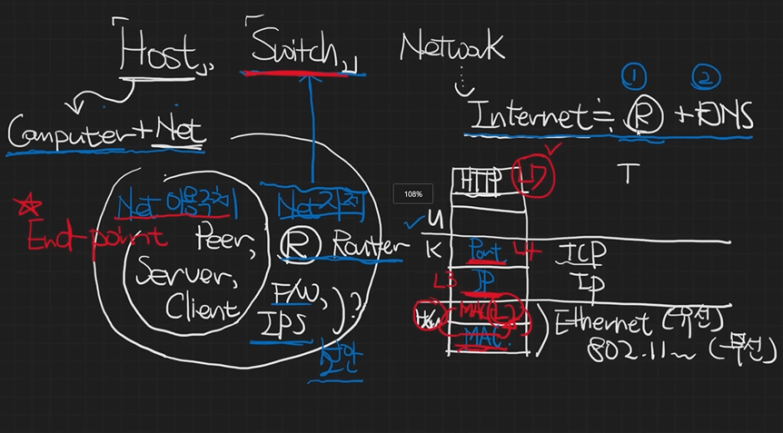

## Host, Switch, Network

- Host: 네트워크에 연결된 컴퓨터
  - Host가 네트워크를 이용하냐, 네트워크 그 자체를 다루냐에 따라 다름
  - **End-point** : 네트워크 상에서 통신의 시작점 또는 종착점이 되는 장치, 네트워크 이용주체
    - Host가 End-point로 작동하는 경우도 많다
    - 예) Peer, Server, Client 등등
- Switch: 컴퓨터와 장치를 연결하는 중간 허브, 네트워크 그 자체를 이룸(내부연결)
  - IP 주소를 다루면 L3 스위치(Router), Port를 다루면 L4 스위치, Http를 다루면 L7 스위치
  - 서로 다른 네트워크를 연결, 데이터 패킷을 올바를 경로로 전달: Router
- Network
  - = Internet
  - Internet은 Router + DNS와 같다(비슷하게)

> 출처: [출처영상](https://www.youtube.com/watch?v=kGst-VftN1w&list=PLXvgR_grOs1BFH-TuqFsfHqbh-gpMbFoy&index=3)