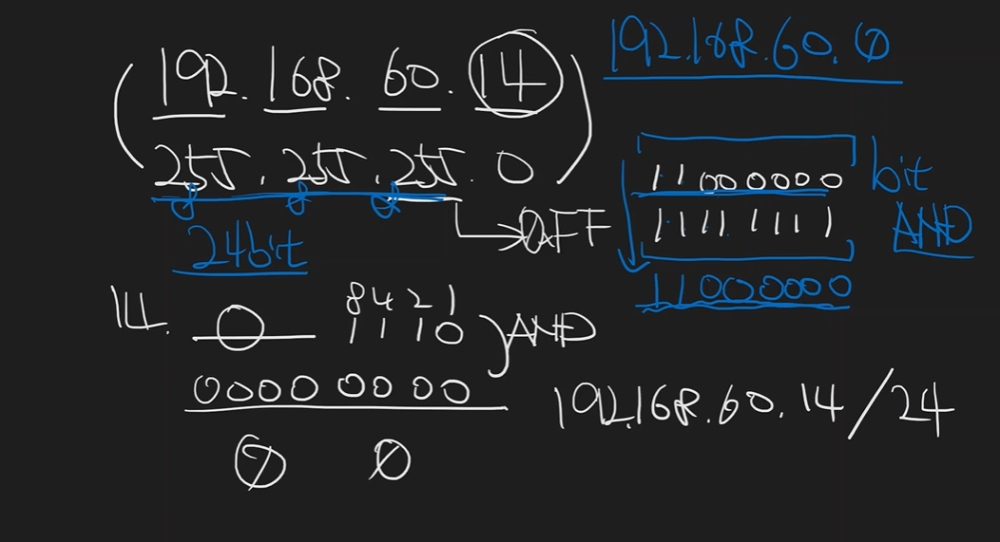

## IPv4

 

- IP: Host에 대한 식별자, Internet Protocol의 약자
- 8bit씩 끊어서 표기한다
- IP = Net Id + Host Id
  - Net Id: 네트워크를 식별하는 ID
  - Host Id: 호스트를 식별하는 ID
- Subnet Mask(=Net Mask): Net Id의 길이
- IP의 버전은 IPv4와 IPv6가 있다
  - IPv4: 주소길이 - 32bit(약 43억개)
  - IPv6: 주소길이 - 128bit

 

CIDR 표기법 : xxxx.xxxx.xxxx.xxxx/32(서브넷 마스크 길이 32)  
프로토콜: 머신 혹은 프로세스 간 데이터 교환 방식을 정의하는 규칙

### Net Id 계산법

- 192.168.60.14/24일때, 서브넷 마스크는 24bit인 255.255.255.0이다
- 서브넷 마스크와 IP주소를 and 연산 하면 192.168.60.0이다
- Net Id는 192.168.60.0이다

> 출처: [출처영상](https://www.youtube.com/watch?v=kGst-VftN1w&list=PLXvgR_grOs1BFH-TuqFsfHqbh-gpMbFoy&index=4)