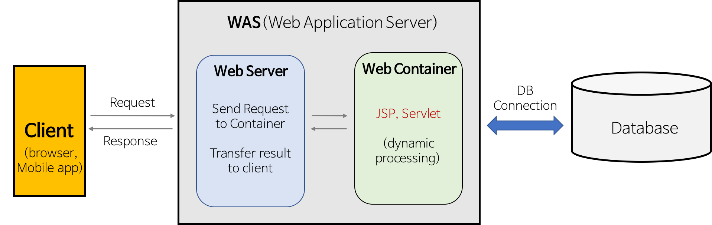

# Proxy

<br>

## 웹 서버와 WAS
### 웹 서버
- 정적 콘텐츠 제공과 클라이언트와의 통신을 처리하는 역할을 수행
- 클라이언트로부터 HTTP 요청을 받아들이고, 해당 요청에 대한 처리를 수행하여 클라이언트에게 HTTP 응답을 전송
- ex) Apache HTTP Server, NginX

요청에 따라 아래 두 가지 기능 중 적절하게 선택하여 수행

1. without WAS - 정적 페이지 제공
    - WAS를 거치지 않고 바로 정적인 웹 컨텐츠를 제공한다.
    - HTML, CSS, 이미지 파일 등과 같은 정적 파일을 클라이언트에 전송하여 웹 페이지를 표시한다.

2. with WAS - WAS에게 요청 전달
    - 동적인 컨텐츠 제공을 위해 WAS에게 요청을 전달한다.
    - 클라이언트의 요청(Request)을 WAS에 보내고, WAS가 처리한 결과를 클라이언트에게 전달(Response)한다.

<br>

### WAS
- 동적 콘텐츠 생성과 DB와의 상호 작용을 처리하는 역할
- DB와의 상호 작용, 비즈니스 로직 처리, 트랜잭션 관리 등을 수행
- 웹 서버와 함께 작동하여 클라이언트 요청에 대한 동적인 처리를 담당
- ex) Apache Tomcat, JBoss, WebSphere

<br>

### 웹 서버와 WAS의 협업



<br>

- 위 그림과 같이 WAS는 웹 서버와 웹 컨테이너를 통합하여 제공
    - 이 구조를 일반적으로 사용
- 웹 서버와 WAS 간의 통신은 주로 HTTP 프로토콜을 사용
    - 클라이언트와 웹 서버간의 통신도 HTTP 통신
- 웹 서버와 WAS가 통합된 소프트웨어로 제공되는 경우엔, 웹 서버와 WAS는 하나의 프로세스 또는 스레드로 실행되며, 내부적으로 통신을 수행

<br>

### 웹서버와 WAS를 분리하는 이유?
-  책임 분할을 통해 서버 부하를 방지하기 위하여
    - 정적 컨텐츠는 웹 서버가, 동적 컨텐츠는 WAS가 담당하도록 하여 서버 부하 분산
- 로드 밸런싱
    - 웹 서버에 들어온 요청들을 여러대의 WAS에 적절히 분배

<br>

## Forward Proxy와 Reverse Proxy

### 프록시(Proxy)란?
>  프록시(Proxy)는 "대리"의 의미로, 인터넷과 관련해서 쓰이는 경우, 특히 내부 네트워크에서 인터넷 접속을 할 때에, 빠른 액세스나 안전한 통신등을 확보하기 위한 중계서버를 "프록시 서버"라고 일컫는다.

<br>
프록시 서버는 위치에 따라 포워드 프록시(Forward Proxy), 리버스 프록시(Reverse Proxy) 두 가지 유형으로 나뉜다.

<br>

### 포워드 프록시(Forward Proxy)
- 일반적으로 프록시라고 하면 포워드 프록시를 뜻한다.
- 프록시 서버는 같은 내부망에 존재하는 클라이언트의 요청을 외부 네트워크(인터넷)로 중계
- 서버에게 클라이언트가 누군지 감추는 역할을 한다. 
    - 서버에서 받는 IP는 클라이언트의 IP가 아니라 프록시 서버의 IP이다.

<br>

포워드 프록시의 주요 역할로는 **캐싱**, **익명성**, **액세스 제어**가 있다.


#### 캐싱
- 포워드 프록시는 웹 페이지나 이미지와 같이 자주 요청되는 컨텐츠를 캐싱한다.
    - 많은 사람들이 약속이라도 한 듯 동시에 웹 서핑을 요청하는 경우는 거의 없었기 때문에 이득인지 의문

#### 익명성
- 클라이언트의 IP주소와 신원을 숨길 수 있어 익명성과 개인 정보 보호를 제공
    - 익명성이 목적이라면 VPN이 더 좋다. 프록시와 달리 암호화가 되기 때문

#### 엑세스 제어
- 포워드 프록시는 액세스 제어 정책을 설정하여 특정 사이트나 콘텐츠에 대한 액세스를 제한할 수 있다.
- 이를 통해 조직이나 기관에서 인터넷 사용을 관리하거나 악성 콘텐츠를 필터링할 수 있다.
    - VPN도 액세스 제어 가능, 프록시보다 훨씬 더 깊은 수준(네트워크 전체)을 제어한다.

<br>

### 프록시 vs VPN
- 가상 프라이빗 네트워크(VPN)는 암호화를 프록시 서버와 결합하여 보다 안전한 통신 채널을 만듬

- 프록시 작동 구조
    - 애플리케이션 레벨
    ```
    브라우저(또는 앱) → 프록시 서버 → 목적지 서버
    ```
- vpn 작동 구조
    - 네트워크 레벨(3계층) 전체를 터널링
    ```
    기기 전체 네트워크 → VPN 터널 → VPN 서버 → 목적지
    ```

<br>

| 구분      | 프록시             | VPN                              |
| --------- | ------------------ | -------------------------------- |
| 동작 레벨 | 애플리케이션 레벨  | 네트워크 레벨                    |
| 적용 범위 | 특정 앱/프로토콜   | 전체 트래픽                      |
| 암호화    | 있을 수도 있음     | 거의 항상 암호화                 |
| 목적      | 우회, 캐싱, 필터링 | 사생활 보호, IP 변경, 보안, 우회 |
| 설정      | 앱에서 설정        | OS나 시스템에서 설정             |

<br>

그래서 실무 인프라에서 “프록시 구축합니다”라고 하면  
대부분 Nginx **리버스 프록시**를 의미

<br>

### 리버스 프록시 (Reverse Proxy)
- 클라이언트에게 서버가 누군지 감추는 역할을 한다.
    - 클라이언트에서 받는 IP는 서버의 IP가 아니라 프록시 서버의 IP이다.
- 즉, 리버스 프록시는 서버의 앞단에 위치하여 클라이언트 요청을 여러 대상 서버로 분산하여 전달하는 역할

<br>

리버스 프록시의 주요 역할로는 **부하 분산**, **보안**, **캐싱**, **애플리케이션 관리**가 있다.

#### 부하 분산(로드 밸런싱)
- 리버스 프록시 뒤에 여러개의 WAS를 둠으로써, 사용자의 요청을 분산할 수 있다.
- 리버스 프록시가 “URL(엔드포인트)에 따라 다른 서버로 요청을 보낼 수 있다

<br>

예를 들어,
```
https://my-service.com/api/
https://my-service.com/auth/
https://my-service.com/media/
```

이 3개는 모두 “my-service.com” 도메인인데 리버스 프록시는 경로별로 다른 서버로 트래픽을 라우팅

```
사용자 → NGINX(리버스 프록시)
             ↓
   /api   →  API 서버 A
   /auth  →  인증 서버 B
   /media →  파일 서버 C
```
같은 도메인이지만 기능별로 서버를 분리해서 트래픽을 나누는 것을 의미

<br>

#### 보안
- 웹 서버의 직접적인 접근을 차단함으로써 보안을 강화한다.
- 웹 서버의 IP와 신원을 숨기고, 악성 공격으로부터 보호한다.
- 이 때, 클라이언트가 직접적으로 웹 서버의 IP를 알 수 없으므로, 보안이 다소 취약한 HTTP 프레임워크를 숨겨 이를 보호할 수 있다.

#### 캐싱
- 리버스 프록시도 포워드 프록시와 마찬가지로 캐싱을 사용하여 자주 요청되는 컨텐츠를 저장하고 동일한 요청에 대해 캐싱된 응답을 제공할 수 있다.

#### 애플리케이션 관리
- 여러 개의 서버나 어플리케이션을 하나의 도메인 아래에 통합할 수 있다.
- 즉, 다양한 어플리케이션을 단일 진입점에서 관리할 수 있으며, URL 라우팅, SSL 인증서 관리 등을 수행할 수 있다.
- 또한, 하나의 IP로 다수의 웹 서버를 동작시킬 수 있으므로 IPv4의 한정된 수량 및 가격적인 측면에서 이점이 있다.

<br><br>

출처
> [웹 서버와 WAS](https://xxeol.tistory.com/28)

> [[Proxy] Forward Proxy와 Reverse Proxy](https://xxeol.tistory.com/29)

> [[웹 서버] Proxy 서버와 Forward, Reverse 프록시](https://jcdgods.tistory.com/322#none)

> [나무위키 - 프록시 서버](https://namu.wiki/w/%ED%94%84%EB%A1%9D%EC%8B%9C%20%EC%84%9C%EB%B2%84)

> [프록시, VPN 차이](https://m.blog.naver.com/PostView.naver?isHttpsRedirect=true&blogId=reductionist101&logNo=221567693949)

> [프록시와 VPN의 차이점은 무엇인가요?](https://aws.amazon.com/ko/compare/the-difference-between-proxy-and-vpn/)