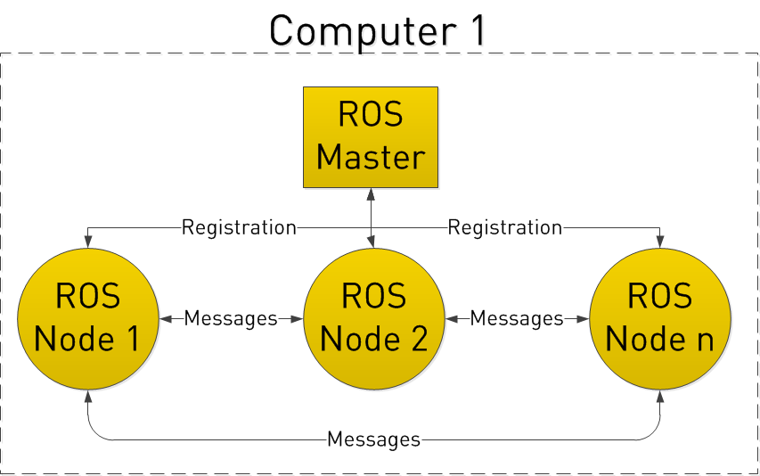
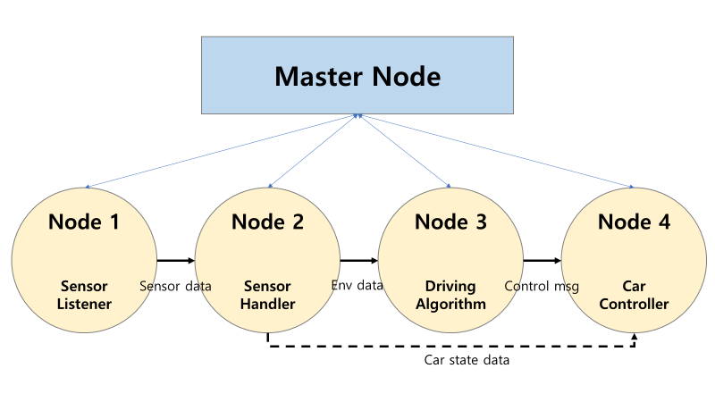

# ROS 개념 정리

<br>

## ROS란

> 로봇 운영체제(ROS,Robot Operating System)는 로봇 응용 프로그램을 개발할 때 필요한 하드웨어 추상화, 하위 디바이스 제어, 일반적으로 사용되는 기능의 구현, 프로세스간의 메시지 패싱, 패키지 관리, 개발환경에 필요한 라이브러리와 다양한 개발 및 디버깅 도구를 제공한다. ROS는 로봇 응용 프로그램 개발을 위한 운영체제와 같은 로봇 플랫폼이다.

즉, Robot Operation System이라는 말과는 다르게, ROS는 운영체제가 아니라 로봇 개발을 위한 라이브러리(혹은 프레임워크)이다

<br>

## ROS의 구조

> **노드** : 로봇 시스템에서 하나의 기능 단위를 담당하는 **실행 단위 프로그램**

특징
- 작은 프로그램 단위다
    - 센서 데이터를 읽는 기능
    - 카메라 영상을 처리하는 기능
    - 모터를 제어하는 기능
    - 데이터를 기록하는 기능
- 노드끼리 통신한다.
    - ROS에서는 노드들이 서로 직접적으로 함수 호출을 하거나 메모리를 공유하지 않는다.
    - 대신 토픽(topic), 서비스(service), 액션(action) 등을 통해 데이터를 주고받으며 느슨하게 결합되어 있다.

<br>



<br>

**ROS는 노드(Node)라고 하는 작은 프로그램의 집합이며, 각각의 노드끼리 서로 Message를 주고 받고 할 수 있다**

<br>

ROS없이 제로 빌드를 한다면?
```python
def listenSensor(port):
	# Code for listening sensor
	return sensorData
    
def hanleSensorData(sensorData):
	# Code for handle sensor data
	return envData
    
def makeDrivingAlgorithm(carState, envData):
	# Code for determine action
    return controlCmd
    
def controlCar(controlCmd):
	# Code for control car
	return carState
    

if __name__ == "__main__":
	th = thread.Threading(target=listenSensor)
	th.start()

	while True:
    	logic = makeDrivingAlgorithm(carState, envData)
        carState = controlCar(logic)

```
- 예외 처리를 매우 신중하게 하지 않는다면 **매우 사소한 예외로 프로그램 전체가 멈출** 가능성도 있다
- 기본적으로 이런 프로그램 방식은 싱글 코어를 이용한 연산을 하기 때문에 **스케쥴링에도 문제**가 발생
- 로직들이 서로 의존적으로 작성되어있기 때문에, **하나의 파트를 수정하다가 다른 부분이 연쇄적으로 문제를 만들어 낼 수 있다**

<br>

ROS를 이용한다면?



<br>

- **하나의 노드가 멈춰도 전체적인 프로그램은 작동**
- ROS가 자체적으로 프로그램 스케쥴링을 진행해주니, 자**원 관리 측면에서 매우 편리**
- 프로그램을 수정할 필요가 생겼을 때는, 각각의 노드를 수정
- 다른 노드에서 발행하는 정보가 추가적으로 필요해질 경우, 해당 노드에서 발행(Publish)하는 메세지를 수신(Subscribe)하는 부분만 추가하면 끝나기 때문에, **확장성 면에서도 매우 우수해진다**

<br>

## 개념

### 토픽
- node 간의 message 교환을 위해 bus 역할을 하는 topic이 필요
    - 메시지 : ROS 노드들끼리 정보를 주고받는 단위 데이터
- 퍼블리셔와 서브스크라이버가 서로 연결되는 중간 통로
- topic은 publisher - subscriber model로 구성되어 있다

    - **퍼블리셔** : 메시지를 **보내는 역할**. 특정 **토픽(topic)**에 데이터를 발행(publish)
        - 예: `/sensor/temperature`라는 토픽에 온도 값 송신
        - **토픽명 + 메시지 타입**을 지정하고, 정해진 주기나 조건에 따라 메시지 전송
        - 예시
        - ```python
            self.publisher = self.create_publisher(String, 'hello_topic', 10)
            self.publisher.publish(String(data='hello world'))
            ```

    - **서브스크라이버** : 퍼블리셔가 발행하는 특정 토픽을 **구독(subscribe)** 해서 데이터를 **수신**함
        - 퍼블리셔와 동일한 토픽명을 지정해야 연결됨
        - 메시지가 수신되면 지정한 콜백 함수가 자동으로 실행됨
        - 예시
        - ```python
            self.subscription = self.create_subscription(
                String, 'hello_topic', self.listener_callback, 10)

            def listener_callback(self, msg):
                print('수신:', msg.data)
            ```
- 이때 topic은 point-to-point일 필요는 없다.
- 1:1, 1:다, 다:다 모든 경우가 가능하다고 한다

<br>

### Action(액션)
- **Action은 서버와 클라이언트 간의 비동기식 양방향 메세지 통신이다.**
- 요청 후에 응답까지 오랜 시간이 걸리고 중간 결과 값이 필요할 때 사용하는 장기적인 실행 작업이다.
- 또한 service와 topic을 기반으로 구축되는데, 이때 goal service, feedback topic, result service의 세 부분으로 이뤄진다.

<br>

### Parameter(파라미터)
- node의 구성하는 값이다. 즉 노드에서 사용하는 파라미터를 의미  
- 매개변수를 노드 설정이라고 판단할 수 있다
- 노드는 매개변수를 정수, 부동 소수점, boolean, 문자열 등등으로 저장할 수 있다고 한다.  
- 이는 파라미터 서버에서 관리하고 프로그램이 동작하는 도중에 실시간으로 변경 가능하다.

### DDS
- 실시간 분산 시스템에서 데이터를 효율적으로 송수신하기 위해 사용하는 미들웨어 표준
- 사용 분야: 로봇, 자율주행, 항공, 군사, IoT 등에서 많이 사용됩니다.    
- 특징: 퍼블리셔-서브스크라이버(Pub-Sub) 모델, 실시간 데이터 교환, 높은 신뢰성과 확장성

### SLAM
- 로봇이나 자율주행 차량과 같은 이동체가 자신의 위치를 파악하면서 동시에 주변 환경 지도를 만드는 기술

### CAN
- 자동차, 로봇, 산업 장비 등에서 여러 제어기(ECU, 센서, 액추에이터 등)가 데이터를 주고받을 수 있도록 만든 **네트워크 통신 규격**입니다.
- 배선이 복잡해지는 걸 막고, 빠르고 신뢰성 있게 데이터를 교환하기 위해 사용됩니다

###  CAN speed
- CAN speed는 CAN 버스(통신선)에서 데이터가 전송되는 속도, 즉 **비트 전송률(bitrate)**을 의미
- 단위: **bps (bits per second, 초당 비트 수)**

<br>

## ROS2

<br>

ros에는 다음과 같은 문제가 있다
- 실시간성 보장 x
- 보안에 취약
- Python 2를 사용

이러한 부분을 보완하고자 등장한 것이 ROS 2이다