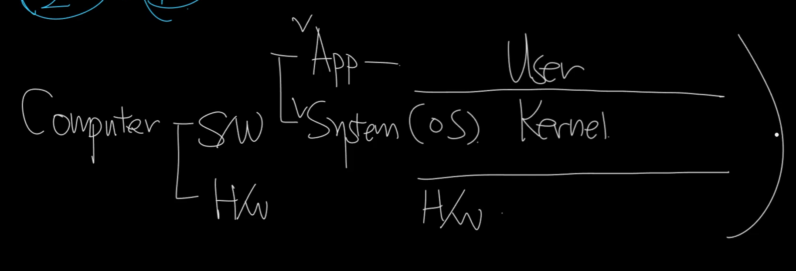

## 네트워크 공부 전 기본지식

<br>

### 메모리 32bit 의미

1바이트 = 8비트

1KB = 2^10바이트 = 1,024바이트

1MB = 2^20바이트 = 1,048,576바이트

1GB = 2^30바이트 = 1,073,741,824바이트
- 바이트 단위가 기준이다.
- 2^30 = 1GB
- 4GB = 4 x 1GB = 2^2 x 2^30 = 2^32

<br>

### 프로그램과 프로세스

```
프로그램(설계도, 파일) → 실행 → 프로세스(운영 중)  
|                                        |  
여러 모듈(기능)   ← 프로세스가 필요하면 불러서 사용  
```
- 프로그램: 실행 가능한 파일 (아직 실행 안됨)
    - 요리 레시피(책장에 꽂혀 있는 상태)

- 프로세스: 실행 중인 인스턴스 (메모리 등 자원 할당됨)
    - 레시피 꺼내서 실제로 요리하는 중!

<br>

### 2진수 -> 16진수
2진수: `1101010`
- 오른쪽부터 4자리씩 끊기:  
  `1101010` → 앞에 0을 추가해서 0110 1010

- 변환:
    - `0110`= 6
    - `1010` = A
- 답: 6A

<br>

### 범용 운영체제



- 범용 운영체제는 User mode와 Kernel mode가 존재한다
- **보안**과 **안정성** 때문에 둘로 나눔
- 일반 프로그램이 멋대로 컴퓨터를 망가뜨리거나, 다른 프로그램을 방해하는 걸 막으려고
- 위험하고 중요한 일은 커널에게만 맡기고, 나머지는 User mode에서 안전하게 실행
1. #### User mode(사용자 모드)
- 우리가 실행하는 일반 프로그램(앱, 게임, 워드 등)은 User mode에서 돌아감
- 이 모드에서는 운영체제의 핵심 자원(메모리, 하드, 네트워크 등)에 직접 접근 불가
2. #### Kernel mode(관리자 모드)
- 운영체제의 핵심(커널)이 동작하는 모드
- 모든 명령어, 모든 하드웨어 자원에 직접 접근 가능
- 예:
    - 메모리 관리
    - 파일 시스템 접근
    - 하드웨어 제어
- 이 모드에서 잘못 동작하면 컴퓨터 전체가 멈추거나 망가질 수도 있음  
  그래서 일반 프로그램은 Kernel mode로 못 들어감

<br>

### Buffer
- 버퍼: 데이터를 잠깐 쌓아두는 공간
    - 임시 저장 공간
- 버퍼링: 그 버퍼를 활용해서 데이터를 채우는 동작

<br>

### Layer와 Layered 구조
- Layer: 역할을 나눈 "계층"이라는 뜻, 구성요소를 의미
- Layered 구조
    - Layer가 쌓여서 전체 시스템을 이룸
    - 레이어의 존립이 의존적이다
        - 일렬종대 관계
        - 이것이 존재하려면 저것이 전제되고, 저것이 존재하려면 저저것이 전제
        - 예로는 학사학위가 있다는건 자동으로 고졸,중졸,초졸을 의미

<br>

### 네트워크와 네트워킹 그리고 개념

OSI 7Layer
- 레이어드 구조로 되어있음
- 프로토콜은 의존적으로 레이어드 구조로 관계가 성립된다

네트워크: 컴퓨터, 서버, 라우터 등 여러 장비의 **관계**다  
네트워킹:  네트워크(관계) 위에서 데이터를 주고받고, 소통하는 실제 **상호작용**이다  
프로토콜: 계층별로 정해진 규칙  

<br>

### User mode와 Kernel mode
```
- 하드웨어 - NIC(Lan 카드)                            |   L1
- 소프트웨어 - 커널 모드 - 드라이버(Nic의 인터페이스)    |  L2 (커널의 드라이브 + 하드웨어의 일정수준 펌웨어까지)
                       - TCP/IP                      |  L4/L3
            - 유저 모드 - FILE                        |  L5, L6, L7
                       - 프로세스                     |
```
- 소켓: TCP/IP를 추상화한 인터페이스로 파일의 한 종류
- 파일을 열어서 프로세스가 동작함