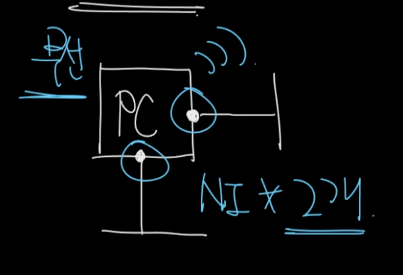
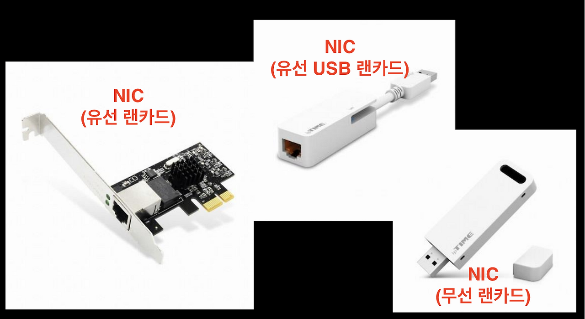

# L2 수준에서 외울 것들

 

### NIC, L2 Frame, LAN 카드 그리고 MAC 주소
- NIC(Network Interface Card) = LAN(Local Area Network) 카드
    - LAN은 네트워크 규모를 말한다
    - WAN > MAN > LAN 순이다. LAN은 가장 작은 규모
- 유/무선 NIC이 있지만 굳이 구별하지 않고 NIC이라고 할 때가 많다
- NIC은 H/W이며 MAC주소를 갖는다
- Host ≒ 컴퓨터 + Net

 

- 보통 NIC은 위와 같이 표현
- NIC이 2개 이상일 수도 있다

   

- Frame: L2에서 네트워크 상의 데이터를 주고받을 때 사용하는 기본 단위
- 패킷은 프레임에서 감싸져서 이동
- 이더넷 프레임의 최대 크기는 1,514 바이트(약 1.5KB)

 

속도
- 1Gbps 일때 b 가 소문자이면 bit
- 1GBps 로 b 가 대문자면 byte
- 이 둘은 약 8배의 속도차이가 남
- 기가 비트 랜 카드, 기가 비트 네트워크와 같이 표현할 수도 있다
- 10Gbps 일때는 광 케이블이 구리선 단자가 아닌, 옵티컬 파이버 케이블이 주로 들어감