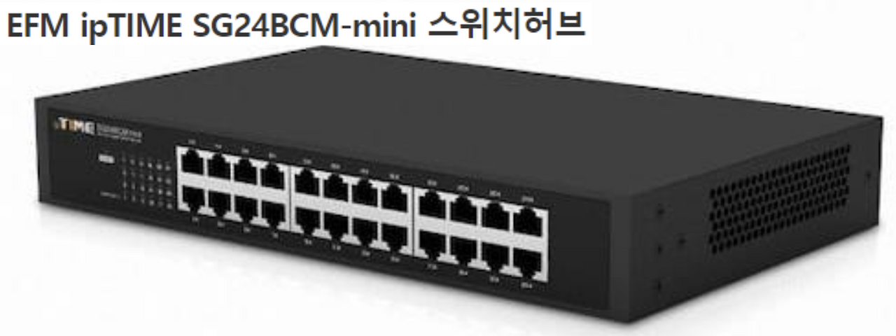

# L2 수준에서 외울 것들

<br>

## NIC, L2 Frame, LAN 카드 그리고 MAC 주소
- NIC(Network Interface Card) = LAN(Local Area Network) 카드
    - LAN은 네트워크 규모를 말한다
    - WAN > MAN > LAN 순이다. LAN은 가장 작은 규모
- 유/무선 NIC이 있지만 굳이 구별하지 않고 NIC이라고 할 때가 많다
- NIC은 H/W이며 MAC주소를 갖는다
- Host ≒ 컴퓨터 + Net

<br>


- 보통 NIC은 위와 같이 표현
- NIC이 2개 이상일 수도 있다


<br><br><br>


- Frame: L2에서 네트워크 상의 데이터를 주고받을 때 사용하는 기본 단위
- 패킷은 프레임에서 감싸져서 이동
- 이더넷 프레임의 최대 크기는 1,514 바이트(약 1.5KB)

<br>

속도
- 1Gbps 일때 b 가 소문자이면 bit
- 1GBps 로 b 가 대문자면 byte
- 이 둘은 약 8배의 속도차이가 남
- 기가 비트 랜 카드, 기가 비트 네트워크와 같이 표현할 수도 있다
- 10Gbps 일때는 광 케이블이 구리선 단자가 아닌, 옵티컬 파이버 케이블이 주로 들어감

<br><br><br>

## L2 스위치에 대해서

<br>

### L2 Access Switch

- End-point와 직접 연결되는 스위치
- MAC주소를 근거로 스위칭
- MAC 주소는 48bit, 6bytes이다.

<br><br>



<br>

- NIC 하나 당 케이블 한 가닥이다
- End-point와 직접 연결되는 스위치가 L2 스위치이다. 그리고 이를 L2 Access Switch라 부른다
- DoD 기반에 네트워크 분류를 할 때 1 계층을 Network Access 단이라고 하기 때문에 L2 Access 라 부르는 것이다
- 위 사진은 스위치 허브에 단자들이 있는데 이를 인터페이스 혹은 포트라고 부른다
    - 위 사진은 총 24개 이므로 24포트, 24포트 스위치다
- 포트에서 주황색 -> 충돌, 녹색 -> 정상작동 (NIC도 마찬가지)

<br>


<br>

- PC를 L2 Access에 꽂아서 연결이 성공하면 Link-up, 실패하면 Link-down
- L2 Switch에 나가서 Router 연결이 되어 있는 경우에 연결되어 있는 선을 up-link라 부른다

<br>

### Distribution Switch
- L2 Access 스위치를 위한 스위치
- VLAN 기능을 제공하는 것이 일반적

```
[PC1]──┐                 ┌──[PC3]
       │   VLAN10        │   VLAN20
  [L2 스위치1]       [L2 스위치2]
       └────┬────┬───────┘
            │    │
        [L3 스위치] ← 라우팅 담당, 디스트리뷰션 스위치 (VLAN 간 통신)
            │
         [라우터] ← 외부 인터넷 연결
            │
         [인터넷]
```
- 보통 사무실에 방 하나에 L2가 있고, 층마다 L2 Distribution이 설치되어 있으며, 건물에 Router 가 설치되어 있다

<br><br><br>

## LAN과 WAN의 경계 그리고 Broadcast

1) Broadcast 범위를 생각해보자.
2) Broadcast 주소라는 매우 특별한 주소가 존재한다. (MAC, IP 모두 존재)
3) 논리적인 것인지 아니면 물리적인 것인지로 구분하는 것도 방법이다.
4) 일단 MAN(Metropolitan Area Network)는 제외하자. 

<br>


<br>

- Brpadcast
    - 모든 장비에게 동시에 보내는 통신 방식이다.
    - MAC 브로드캐스트 주소: `FF-FF-FF-FF-FF-FF`
    - IP 브로드캐스트 주소: 예) `192.168.1.255` (서브넷의 마지막 주소)
    - **MAC, IP의 경우 2진수로 봤을 떄 전부 1로 되어 있으면 Broadcasting 이다**
    - 브로드캐스트는 다른 장비들끼리의 송수신을 못하고 **모든 장비가 수신하게 하므로 효율을 떨어 트린다**
        - 네트워크가 느려짐
        - 때문에 Broadcasting은 최소화 시키는 것이 좋다
    - 때문에 Broadcast는 꼭 **필요할 때에만 써야하는 제한적인 통신 방법**이다

- Unicast
    - 1:1 통신 → 특정한 하나의 대상에게만 보내는 방식
    - 대부분의 네트워크 트래픽이 유니캐스트다

<br>

### 전송할 때
- LAN에서 보내는 데이터 단위는 (Frame) 헤더와 바디로 구분된다
- **헤더에는 출발지 주소, 목적지 주소 (MAC 주소)** 그리고 **바디에는 데이터**가 들어있다
- 목적지 주소를 'FF-FF-FF...-FF'와 같이 쓴다면 Broadcasting이 되어버린다
- L2 Distribution 에서 정책적으로 다른 L2 스위치로의 Broadcasting 을 막을 순 있다
    - 이 부분은 고려해야 할 점이 많음

<br>

### 네트워크 규모 문제


<br>

Physical(물리적) → H/W를 설명하는 어휘 → 실체가 있음  
Logical(논리적) → S/W를 설명하는 어휘 → 실체가 없음

- Logical(논리적)을 IT에서는 Virtual(가상)이라는 단어로도 사용될 수 있다
    - ex. CPU를 S/W로 구현할 수 있다.
    - CPU (=Machine) 인데, 소프트웨어로 구현하면 Virtual Machine이 된다.

| 구분          | LAN                                 | WAN                          |
| ------------- | ----------------------------------- | ---------------------------- |
| **범위**      | 근거리 (실제 건물/건물 내부)        | 원거리 (도시, 국가 간 등)    |
| **기준**      | 물리적 연결                         | 논리적 경로, 라우팅 기반     |
| **계층 관점** | OSI 1~2 계층 중심 (물리/데이터링크) | OSI 3~4 계층 (네트워크/전송) |
| **장비**      | 스위치 중심                         | 라우터 중심                  |
| **IP**        | 보통 사설 IP                        | 공인 IP                      |

<br>

> **LAN은 물리적 연결 기준의 작은 네트워크**,  
> **WAN은 인터넷 계층(논리적 라우팅)을 기반으로 한 큰 규모의 네트워크**다