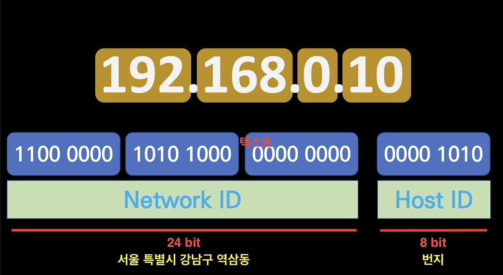
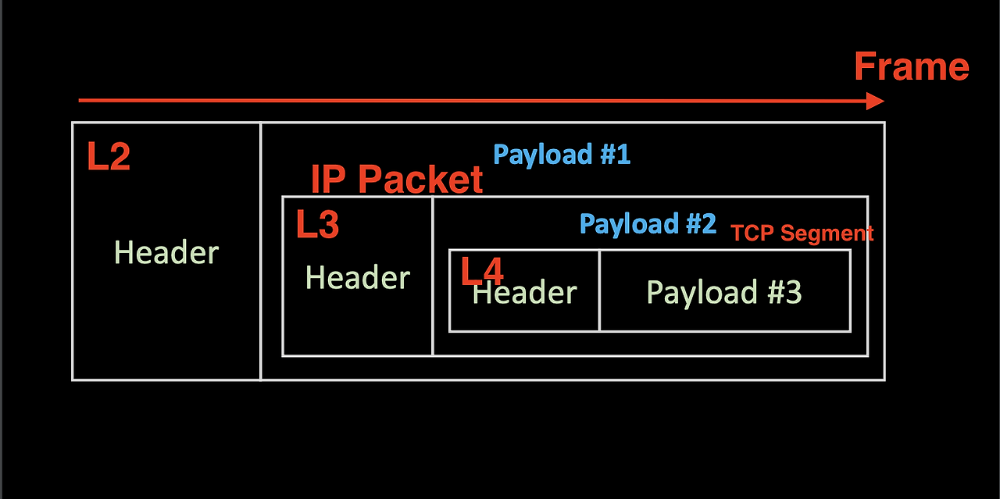
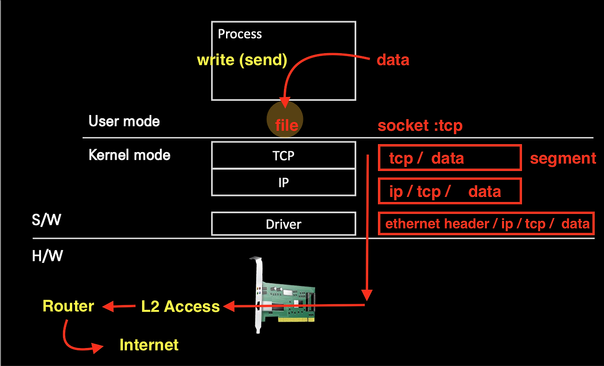

# L3 수준에서 외울 것들 (상)

 

## IPv4주소의 기본 구조

 

IPv4
- 32bit 주소 체계를 가진다.
- IP는 8bit씩 잘라서 점으로 나눈다. 즉, 8bit가 4개 모인 것과 같음
    - 한 단위 당 8bit이기 때문에 0~255까지 표현이 가능하다
- IPv4에서 24bit는 Network ID, 나머지 8bit는 HostID 식별자이다
    - 네트워크 식별자는 Host 를 찾기 위한 큰 단위의 주소 체계를 뜻하며, 호스트 식별자는 네트워크 식별자를 기반으로한 정확한 주소를 의미한다
    - 예시로
    - 네트워크 식별자는 '서울 특별시 강남구 역삼동' 과 같은 식별자
    - 호스트 식별자는 '번지 수'를 의미

   

## L3 IP Packet

1. Packet이라는 말은 L3 IP Packet으로 외워라
    - 패킷: 단위 데이터
    - 비유하자면 퍼즐 조각 또는 송장있는 택배상자
2. Header와 Payload로 나뉘며 이는 상대적인 분류이다
    - Header는 송장, payload는 택배 내용물
3. 최대 크기는 **MTU**
    - **Header부터 Payload까지의 크기**
    - **1500byte** → 1.4kb
    - 인터넷이라는 논리 네트워크에서 분류할 때 최대 단위가 1500byte 밖에 안된다는 의미

 

패킷을 실제 형태로 보는법?
- wireshark (패킷 수집기) 를 통해 패킷을 볼 수 있다. 
    - 패킷을 수집하여 분석하는것에 유용하다.
    - 의사로 따지면 청진기와 같은 역할을 한다.

   

## Encapsulation과 Decapsulation
Encapsulation: 포장했다. 안에 쏙 집어넣었다는 것을 의미
- '단위화' 했다 → 못 보게 했다는 의도가 포함되어 있음

 

 

- 마트료시카 인형 구조를 네트워크 개념으로 바꾸면 위 그림이 된다
- 위 그림에서 L2 Frame 안에 L3가 들어있다
- L2 Payload에 IP Packet이 있고, L3에는 L4가 들어있어 L3 Payload에는 TCP Segment가 있다는 의미이다
- 단, 계속 이런 구조를 갖는 것이 아닌 TCP단 L5 부터는 Stream 형식으로 구성

 

- 인캡슐레이션 → Header/Payload를 Payload화 시켜 감싼 다음, 다시 Header/Payload 를 만드는 구조
- 디캡슐레이션 → Paylaod화 시킨 데이터(Header/Payload)를 꺼내는 것

   

## 패킷 생성과 전달
1. 택배전달을 생각하자. 패킷 = 택배라고 가정했을때
2. data는 패킷으로 감싸지고, 기사라는 gateway를 통해
3. 입력된 집 주소인 host(ip)를 찾아
4. 수신인인 port 번호에 전달된다

 

구체적으로 아래와 같이 표현될 수 있다

 

> 소켓: 파일의 일종으로 User mode application Process가 Kernal mode application Process에 접근할 수 있도록 추상화시켜준 인터페이스다.

 

- TCP 레이어 단에서 segment 형식의 **TCP 정보/ data**가 만들어짐
- IP 레이어 단에서 기존 데이터에서 **IP 정보가 추가**된다
- Driver 단에서도 **이더넷 헤더 정보가 추가**되어 패킷이 만들어지며 이 후 L2 Access와 Router를 거쳐 인터넷으로 전송되는 구조다

   

## 계층별 데이터 단위
