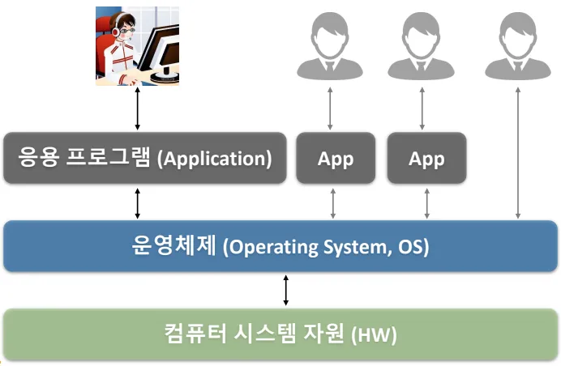

# Linux

 

## 🔎 리눅스 개요

- HW: CPU, Memory, 디스크(스토리지)
- 운영체제
    - 응용 프로그램과 하드웨어의 중간다리 역할
    - ex) Linux, window, mac o/s, 안드로이드, ios
    - 가장 많이 쓰이는 운영체제가 리눅스

 

### ✅ 리눅스
- 리눅스는 1991년 리누스 토발즈에 의해 개발되 오픈소스 운영체제
- 리눅스는 유닉스를 모방하여 만들어진 운영체제다
    - 맥 os,리눅스 등 많은 운영체제가 유닉스에 영향을 받음
    - 윈도우는 독자적인 성향의 운영체제
    - 안드로이드 운영체제는 리눅스 커널을 기반으로 개발

### ✅ 리눅스 배포판
- 리눅스 커널에 다양한 소프트웨어, 패키지 관리자, 설정 도구 등을 더해 하나의 완성된 운영체제를 뜻한다
    - 리눅스 커널 + 유틸리티 + UI + 설정
    - 리눅스 커널 = 엔진, 배포판 = 엔진 + 바퀴 + 핸들 + 시트 + 내비 장착해서 완성
    - Ubuntu가 가장 인기 있는 데스크탑 배포판이다
- 크게 redhat 계열, debian 계열이 있다 
    - 데비안: ubuntu, debian 등
    - 레드햇: redhat, centos 등
### ✅ 주요 리눅스 개념

#### 🧠 커널
- 리눅스의 핵심 컴포넌트
- **하드웨어와 소프트웨어를 연결해주는 역할**
- 프로세스 관리, 메모리 관리, 파일 시스템, 네트워크 등 담당
#### 🗂 파일 시스템 구조
- **트리 구조**라는 계층적 구조를 가지며, 루트`/`라는 최상위 디렉토리가 있음
- 주요 디렉토리
    - `/bin` : 시스템 부팅, 유지관리 등 필요한 사용자 기본 명령어 저장(ls, cp, rm 등)
    - `/etc` : 사용자 계정, 네트워크 설정 등의 설정 파일들
    - `/home` : 사용자 계정 홈 디렉토리
    - `/var` : 로그 등 자주 변경되는 파일
    - `/dev` : 장치 파일
    - `/proc` : 커널 및 프로세스 상태 정보 (가상 파일 시스템)

#### 👥 사용자와 그룹
- 리눅스는 멀티유저 시스템
- 각 파일/디렉토리는 소유자, 그룹, 기타 사용자로 나뉘어 권한 관리 
#### 💻 쉘(Shell) 프로그래밍
- 커맨드라인을 통해 사용자의 명령을 해석하여 운영체제 커널에게 전달 및 실행 
- 대표 쉘: `bash`, `sh`, `zsh`, `fish` 등