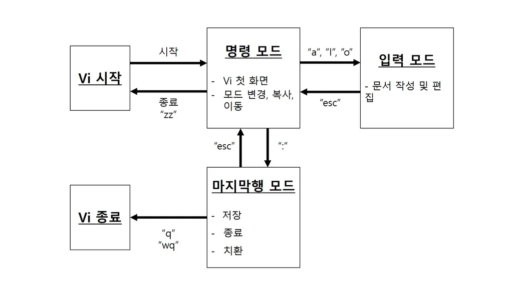

# vi 에디터
 - vi는 UNIX 기반 시스템에서 가장 오래된 텍스트 에디터 중 하나
    - 리눅스 기반 OS설치시 기본적으로 같이 설치
- 리눅스에서 vi의 후속모델인 vim와 nano등의 에디터도 많이 사용
- vi는 명령모드와 입력모드로 구성
    - 명령모드: 텍스트를 편집하는 대신에 커서를 이동하거나 텍스트를 삭제/복사/붙여넣기 하는 등의 명령을 수행
    - 입력모드: 텍스트를 입력하거나 수행 

 

## vi 에디터 명령어들

 

- vi편집기로 파일 열기
    - `vi 파일명`

- 입력모드로 전환
    - i : 현재 커서부터 입력
    - a : 다음 커서부터 입력
    - o : 다음 줄부터 입력
- 명령모드(esc)
    - :q! : 저장없이 나가기
    - :wq : 저장하고 나가기
    - x : 한칸삭제
    - dd : 한줄삭제
    - yy : 한줄복사
    - p : 복사내용을 다음줄부터 붙여넣기
    - G : 마지막 줄로 이동
    - gg : 파일의 첫줄로 이동
    - ctrl+f : 다음페이지로 이동
    - ctrl+b : 이전페이지로 이동
    - /검색하고자 하는 문자열 : 문자열검색 