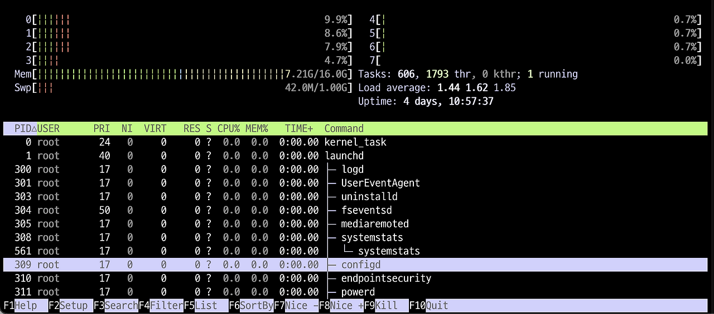
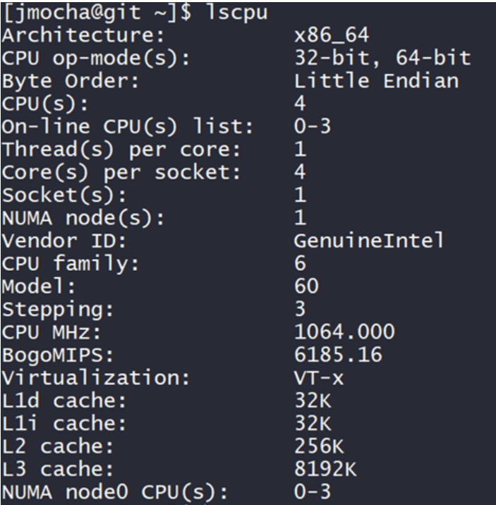
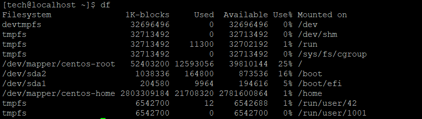

# 🖥️ 모니터링
- 시스템 상의 상태 변화를 지속적으로 감시하는 과정

<br>

## 1) CPU

#### 명령어: `top` or `htop`



- htop 화면을 살펴보면 왼쪽 상단에 CPU, swap메모리,메모리 사용률이 표현되어 있으며, 하단에는 모니터링되고 있는 프로세스가 보이며 1초에 한 번씩 갱신
- 선택된 프로세스를 죽이거나, 우선순위를 변경할 수 있다.특정 프로세스 이름으로 검색, 필터링하여 현황을 볼 수 있다.
- pstree와 top을 함께 보는 기능이 있다.
- cpu의 코어 갯수를 확인해서 각 프로세스의 정보를 top보다 더 디테일하게 모니터링 가능

<br>

#### 시스템 전체 CPU 사용률
> 최상단 왼쪽에 CPU/코어별 사용률이 보이는데 게이지바의 색깔이 의미하는 바는 다음과 같다.

- 파랑: 우선 순위가 낮은 프로세스(nice > 0)
- 초록: 일반(사용자) 프로세스
- 빨강: 커널 프로세스
- 노랑: IRQ time
- 자주: Soft IRQ time
- 회색: IO Wait time
 
#### 시스템 전체 메모리 사용률
> CPU 사용률 아래에 메모리와 스왑 사용량이 보이는데 게이지바의 색깔이 의미하는 바는 다음과 같다.

- 초록: 사용 중인 메모리 페이지
- 파랑: 버퍼 페이지
- 노랑: 캐쉬 페이지

#### 평균 부하율(Load average)
- 일정 시간 동안의 평균 부하율로 top이나 uptime과 마찬가지로 1, 5, 15분 간격으로 평균 수치가 나온다. 싱글 코어 CPU일 때 1.0이면 사용률이 100% 임을 의미한다. 쿼드 코어라면 4.0이 100%다. 다만 이때 1.0을 넘을 수도 있는데 이는 CPU를 할당받기 위해 프로세스들이 기다려야 함을 뜻한다.
 
#### 프로세스 정보
- PID: 프로세스의 프로세스 ID 번호
- USER: 프로세스의 소유자
- PR: 프로세스의 우선순위
- NI: 우선순위에 영향을 주는 프로세스의 nice 값
- VIRT: 프로세스가 사용 중인 가상 메모리 양
- RES: 프로세스가 사용 중인 물리 RAM의 양(단위는 킬로바이트)
- SHR: 프로세스가 사용 중인 공유 메모리 양
- S: 프로세스의 현재 상태(zombied, sleeping, running, uninterruptedly sleeping, traced)
- %CPU: 프로세스가 프로세서를 사용한 시간의 백분율
- %MEM : 프로세스가 사용 중인 물리 RAM의 백분율
- TIME+: 프로세스가 프로세서를 사용한 시간
- COMMAND: 프로세스 시작에 사용한 명령어

---

<br>

Linux 시스템에서 CPU의 정보를 알아내는 기본 경로인 `/proc.cpuinfo` 파일에 여러정보가 있다

#### 명령어: `lscpu`



<br>

- Socket(s): 1
    - 메인보드에 CPU(소켓)가 1개 장착되어 있다는 의미
- Core(s) per socket: 4
    - 각 CPU(소켓)마다 8개의 물리 코어가 있음
    - 즉, 총 물리 코어 1 × 4 = 4개
- Thread(s) per core: 1
    - 각 코어당 1개의 스레드를 처리
- CPU(s): 4
    - 운영체제에서 인식하는 논리적 CPU(프로세서) 수 = 4개
    - 계산식: 1(소켓) × 4(코어) × 1(스레드) = 4
---

<br>

#### 명령어: `uptime`
- 부하 확인  
```
$ uptime
 17:24:36 up  7:34,  0 users,  load average: 0.04, 0.04, 0.00
 ```
 - 17:24:36: 현재 시간
 - 서버가 7시간 34분 동안 켜져 있다
 - 현재 로그인중인 사용자 수 0명
 - load average: 0.04, 0.04, 0.00: 시스템 부하 평균
    - 각 숫자는 1분, 5분, 15분 동안의 평균 부하를 의미
    - **숫자가 낮을수록 시스템이 한가함**, 일반적으로 “CPU 개수 이하”라면 무리가 없는 상태

<br><br>

### 3) 메모리

명령어: `free -h`
```
               total        used        free      shared  buff/cache   available
Mem:           6.7Gi       1.7Gi       4.6Gi       4.0Mi       343Mi       4.8Gi
Swap:          2.0Gi          0B       2.0Gi
```
- Mem : 시스템의 물리적인 메모리에 대한 사용량을 각 필드로 표시
- Swap : 디스크를 메모리처럼 사용하는 용량을 각 필드로 표시
- total : 전체 메모리의 용량을 가독성 좋은 단위로 표시
- used : 현재 시스템에서 사용중인 메모리의 양을 가독성 좋은 단위로 표시
- free : 현재 시스템에서 사용하지 않는 메모리의 양을 가독성 좋은 단위로 표시
- shared : 현재 시스템에서 공유한 메모리의 용량을 표시
- buff/cache : 현재 캐시메모리에서 버퍼링된 사용량을 표시
- available : swapping 없이 새로운 프로세스에서 할당 가능한 메모리의 예상 크기
---

<br>

명령어: `vmstat`
- 메모리, 프로세스, IO 등 종합 통계
- `vmstat 1`: 1초 간격으로 업데이트
```
$ vmstat
procs -----------memory---------- ---swap-- -----io---- -system-- ------cpu-----
 r  b   swpd   free   buff  cache   si   so    bi    bo   in   cs us sy id wa st
 0  0      0 504328   2088 342004    0    0  9076   243  512 3103 36 10 26  1 26
 ```
1. procs 필드
    - r : CPU 접근 대기 중인 실행 가능한 프로세스 수
    - b : I/O 자원을 할당 받지 못해 블록된 프로세스의 수
2. memory 필드
    - swpd : 사용된 가상 메모리의 용량
    - free : 사용가능한 여유 메모리의 용량
    - buff : 버퍼에 사용된 메모리의 총량
    - cache : 페이지 캐시에 사용된 메모리의 용량
3. swap 필드
    - si : swap-in된 메모리의 양(kb)
    - so : swap-out된 메모리의 양(kb), swap-out가 지속적으로 발생한다면 메모리 부족을 의심
4. I/O 필드
    - bi : 블록 디바이스로부터 입력 블록수
    - bo : 블록 디바이스에 쓰기 블록수
5. system 필드
    - in : 초당 발생한 interrupts의 수
    - cs : 초당 발생한 context switchs(문맥교환)의 수
6. CPU 필드
    - us : CPU가 사용자 수준 코드를 실행한 시간 (단위: %)
    - sy : CPU가 시스템 수준 코드를 실행한 시간 (단위: %)
    - id : idle 시간
    - wa : I/O wait 시간


<br><br>

### 4) 디스크
명령어: `df -h`
> df 명령어는 "Disk Free"의 약어로서 현재 사용중인 파일시스템의 전체크기, 사용중인 크기, 사용가능한 크기, 사용율, 마운트정보등을 보여주는 리눅스 내장 명령어다.



---

<br>

명령어: `iostat`
- 디스크 I/O 상태

