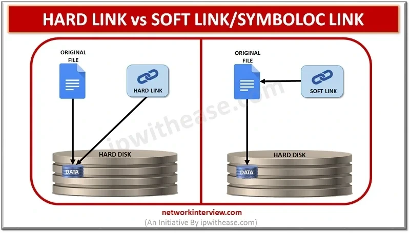

# 심볼릭 링크

<br>

- 파일이나 디렉토리의 경로(Path)를 참조하는 별도의 파일
- 데이터를 저장하지 않으며, 원본 파일의 위치 정보를 문자열로 저장하여 이를 통해 원본 데이터에 접근
    - Like Window의 바로가기 접근

<br>

## 📦 inode

> **inode는 파일의 메타데이터(정보)를 저장하는 데이터 구조체이다.**

- inode는 파일 시스템과 디스크 스토리지 사이에서 파일과 실제 데이터 블록을 연결하는 역할을 수행

예를 들면:

- 파일의 크기
- 파일의 소유자(user, group)
- 파일의 퍼미션(권한)
- 생성/수정/접근 시간
- 파일 데이터가 저장된 블록 위치(주소)
- 하드 링크 수

**반대로, 파일 이름은 inode에 저장되지 않는다**

<br>

메타데이터란?
- **파일 자체의 내용(data)**이 아니라 파일을 설명하는 정보(정보의 정보)
    - 예로는
    - 파일 이름, 파일 크기, 파일 위치, 생성/수정/액세스 시간, 소유자 정보, 파일 권한 등이 있다.
    - 파일 이름만 빼고 나머지 주요 메타데이터는 inode에 저장된다

inode란?
- **리눅스/유닉스 파일 시스템에서 메타데이터를 저장하는 구조체(데이터 블록)**   

<br>

### 실질적인 파일 데이터 저장 방식
실제 파일의 데이터는 디스크 스토리지에 블록 단위로 저장됩니다. 파일 시스템은 이러한 데이터 블록의 위치를 추적하고 파일과 연결하기 위해 inode를 사용합니다.

<br>

## 🔗 하드 링크와 심볼릭 링크
- 리눅스 파일 시스템에서는 주로 **심볼릭 링크(Symlink)** 와 **하드 링크(Hard Link)** 라는 두 가지 링크 유형을 지원

<br>



<br>

하드 링크
- 원본 파일을 참조하는 기능을 수행. 즉, **원본 파일과 동일한 inode를 공유**
- 원본 파일의 File Path 가 변경되거나 파일이 삭제된다해도 해당 링크가 0이 아닌이상 영향X

심볼릭 링크
- 단순히 File Path를 저장
- 단순히 "원본 파일의 데이터" 를 참조하지 않는다. 실제로는 원본 파일의 경로(Path) 만 저장하고, 이를 기반으로 파일에 접근
- 원본 파일의 File Path 가 변경되거나 파일이 삭제된다면 심볼릭 링크는 제 기능을 상실

<br>

### **주요 차이점 요약**

| 구분          | 하드 링크                     | 심볼릭 링크               |
| ------------- | ----------------------------- | ------------------------- |
| 파일 시스템   | 동일 파일 시스템만 가능       | 다른 파일 시스템도 가능   |
| 디렉토리 링크 | 불가(특수한 경우만 가능)      | 가능                      |
| 원본 삭제 시  | 영향 없음(링크 수 0돼야 삭제) | 링크만 남고 접근 불가     |
| inode         | 동일한 inode 번호             | 다른 inode 번호           |
| 역할          | 파일의 또 다른 이름           | 경로를 저장하는 별도 파일 |

<br>

### 링크 생성
하드 링크 생성:

```bash
ln [원본파일] [하드링크파일]
```

예시
```bash
ln /home/user/original.txt /home/user/hardlink.txt
```

결과
```bash
-rw-r--r-- 2 root root    7 Nov 24 00:11 hardlink.txt
lrwxrwxrwx 1 root root   23 Nov 24 00:11 link.txt -> /home/user/original.txt
-rw-r--r-- 2 root root    7 Nov 24 00:11 original.txt
```
- 하드 링크는 온전한 개별 파일로 표현

<br><br>

심볼릭 링크 생성:
```bash
ln -s [원본파일] [심볼릭링크파일]
```

예시:
```bash
ln -s /home/user/original.txt /home/user/link_0.txt
ln -s /home/user/first/original.txt /home/user/link_1.txt
ln -s /home/user/first/second/original.txt /home/user/link_2.txt
ln -s /home/user/first/second/third/original.txt /home/user/link_3.txt
```

결과
```bash
lrwxrwxrwx 1 root root   23 Nov 24 00:30 link_0.txt -> /home/user/original.txt
lrwxrwxrwx 1 root root   29 Nov 24 00:30 link_1.txt -> /home/user/first/original.txt
lrwxrwxrwx 1 root root   36 Nov 24 00:30 link_2.txt -> /home/user/first/second/original.txt
lrwxrwxrwx 1 root root   42 Nov 24 00:30 link_3.txt -> /home/user/first/second/third/original.txt
```
- 생성된 심볼릭 링크의 사이즈를 확인해보면 참조하는 File Path 의 길이만큼 심볼릭 링크의 크기가 결정되는 것을 확인할 수 있다.

