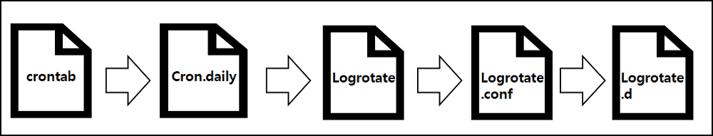

# Logrotate

<br>

로그란
- 커널, 서비스, 애플리케이션 등 시스템에 발생한 이벤트를 분류하여 기록한 파일
- 시스템에 특정 이벤트에 대한 기록이 있으면 해당 이슈가 발생한 시기와 이유를 확인할 수 있다.

로그로테이트
- 로그 파일들을 잘 정리해줄 수 있게 도와주는 시스템 유틸리티
- logrotate는 다음과 같은 기능을 제공한다. 아래 기능들은 주기별로 이루어지거나, 혹은 일정 크기 이상 로그가 커졌을 때 이루어진다. 보통은 daily로 설정된 cron job에 의해 수행된다.

    - 백업
    - 압축
    - 아카이빙
    - 삭제
    - 메일링

<br>

### Logrotate 버전 확인
```shell
$ logrotate --version
logrotate 3.19.0
```

<br>

### Logrotate 관련 파일
| 경로 및 파일                            | 설명                                         |
|-----------------------------------------|----------------------------------------------|
| /usr/sbin/logrotate                    | 실행 파일                                    |
| /etc/logrotate.conf                    | 기본 설정 파일                               |
| /etc/logrotate.d/*                     | 개별 설정 파일                               |
| /var/lib/logrotate/logrotate.status     | logrotate 실행 로그                          |
| /etc/cron.daily/logrotate              | logrotate는 Daily Cron에 의해 구동됨         |

<br>

- /etc/logrotate.conf
    - 이 파일에는 일부 디폴트 설정이 포함되어 있고 시스템 패키지가 소유하지 않은 몆가지 로그에 대한 rotate 설정을 합니다. 
    - 또한 include 명령문을 통해 /etc/logrotate.d 폴더의 모든파일에서 config를 가지고 옵니다.
- /etc/logrotate.d/ 
    - Logrotate가 필요한 모든 패키지(라이브러리)가 Logrotate 설정값을 저장하는 위치입니다. 

<br>

### logrotate 순서
logrotate는 다음의 순서를 따라서 실행이 된다.


<br>

### Logrotate 구성 확인

<br>

/etc/logrotate.conf 
```shell
# see "man logrotate" for details

# global options do not affect preceding include directives

# rotate log files weekly
weekly

# use the adm group by default, since this is the owning group
# of /var/log/syslog.
su root adm

# keep 4 weeks worth of backlogs
rotate 4

# create new (empty) log files after rotating old ones
create

# use date as a suffix of the rotated file
#dateext

# uncomment this if you want your log files compressed
#compress

# packages drop log rotation information into this directory
include /etc/logrotate.d

# system-specific logs may also be configured here.
```
-  루트사용자와 adm그룹이 소유한 로그파일을 주(weekly)단위로 rotate설정을 하고 한번에 4개의 로그파일을 유지

- `weekly` : 로그 파일을 얼마나 순환 시킬 것인지 기간을 정하는 부분
    - weekly외에도 daily, monthly, yearly 설정이 가능하다. 
- `create` : 로그 파일을 정리한 후에 로그파일을 생성할지에 대한 여부
    - create: 로그파일을 생성함
    - empty: 로그파일 생성 안함
- `dateext` : rotate된 파일에 날짜를 부여하는 옵션
- `compress` : 로그 파일의 압축 여부를 지정할 수 있다.
    - compress: rotate되는 로그파일을 gzip으로 압축
    - nocompress: rotate되는 로그파일을 압축하지 않음
- `include /etc/logrotate.d`: 디렉토리를 지정해서 logrotate를 할 수 있다.

<br>

### logrotate.d 내 파일 생성

<br>

```shell
/var/log/nginx/*.log {		# rotate를 수행할 로그들의 경로
    create 0640 nginx root	# 로그 파일 생성시 0644 권한, root 사용자, root 그룹으로 생성
    daily					# 로테이트 주기
    rotate 10				# 로그파일의 개수가 10개 이상이면 가장 오래된 로그파일을 삭제
    missingok				# 로그파일이 없어도 에러처리 안함
    notifempty				# 로그 내용이 없으면 로테이트 하지 않음
    compress				# 로테이트 파일 압축
    delaycompress			# 프로그램이 log 파일에 대한 입력을 종료하지 못하고 일정 기간 계속 쌓아야 할 경우, log 파일에 대한 rotate를 다음 주기로 미룸
    sharedscripts			# 로그 파일이 여러 개 있어도 스크립트를 공유하여 아래 postrotate 스크립트를 한 번만 실행
    postrotate				# 로테이트를 진행후 스크립트 실행
        /bin/kill -USR1 `cat /run/nginx.pid 2>/dev/null` 2>/dev/null || true
    endscript				# postrotate 종료 선언
}
```
/etc/logrotate.d/nginx

<br>

### logrotate 실행

<br>

logrotate 즉시 실행
```shell
# logrotate -f [logrotate.d 내 실행하고자 하는 logrotate 파일 경로]
$ logrotate -f /etc/logrotate.d/nginx

# 아래 명령어는 logrotate.d 내 모든 logrotate에 대해 실행함
$ logrotate -f /etc/logrotate.conf
```

<br>

logrotate 디버그
```shell
# logrotate -d [logrotate.d 내 실행하고자 하는 logrotate 파일 경로]
$ logrotate -d /etc/logrotate.d/nginx

# 아래 명령어는 logrotate.d 내 모든 logrotate에 대해 실행함
$ logrotate -d /etc/logrotate.conf
```

<br>

logrotate 실행 과정 확인
```shell
# logrotate -v [logrotate.d 내 실행하고자 하는 logrotate 파일 경로]
$ logrotate -v /etc/logrotate.d/nginx

# 아래 명령어는 logrotate.d 내 모든 logrotate에 대해 실행함
$ logrotate -v /etc/logrotate.conf
```

결과
```bash
sudo logrotate /etc/logrotate.conf --debug

....
rotating pattern: /var/log/my-app/*.log  after 1 days (14 rotations)
empty log files are not rotated, old logs are removed
No logs found. Rotation not needed.
....
```