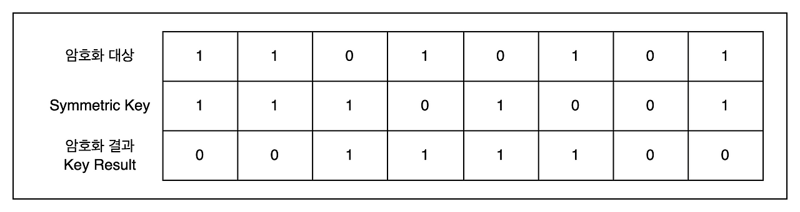

## Checksum(검사합)

- **데이터 오류 여부 확인 방법**으로 널리 사용
  - 보완성이 없음 -> 기밀성, 무결성 X
- 동작 원리
  - 송신 측: 원본 데이터에 대해 일정한 연산(보통 바이트 단위 합산, XOR 등)을 수행하여 검사합(checksum)을 생성.
  - 송신 측: 데이터와 함께 checksum을 전송.
  - 수신 측: 받은 데이터를 다시 같은 방식으로 연산 → checksum 계산.
  - 수신 측: 송신 측의 checksum과 비교 → 값이 다르면 전송 중 오류 발생.
- 일정 자릿수를 정하고 범위를 넘는 자리 올림은 버려서 자릿수를 유지
- 하지만 **악의적 변조(공격자 존재)를 막을 목적**이라면 **불충분**
- 검사합은 **출력값을 맞추는 다른 입력**을 찾는 건 너무 쉽다

> 그렇게 나온 것이 **해시**다.

 

## Hash(함수)의 특징

- **단방향성**
  - **출력값을 맞추는 다른 입력**을 찾기 어려움
- 입력 값의 크기와 상관 없이 **결과 값의 길이(혹은 크기)가 일정**
  - 나머지 연산에서 나머지의 값이 일정 크기기 때문에
- 데이터 무결성 확보와 관련해 IT기술 전반에서 사용
  - 데이터 위변조 X 증명
  - 때문에 체크썸이 할 일을 해시로 대체하기도 함
    - 연산과 로직이 복잡해지지만 체크썸보다 완벽해짐
- 해시가 들어갈 때는 검사합과 유사한 로직이 같이 딸려 들어간다
  - 나눗셈의 나머지(모듈러) 연산을 활용

 

## 대표적인 Hash 알고리즘

- 경우의 수가 많고 겹치는게 적은게(다른 입력값이 같은 결과를 내는 경우) 좋은 알고리즘

- MD-5
  - **패스워드 단반향 암호화에 사용금지**
  - 경우의 수가 너무 적음
  - 전수조사(브루트포스) 공격에 취약함
- SHA-1
- SHA-128, 256, 384, 512
  - 숫자가 클수록 좋음
  - 경우의 수가 넓기 때문

 

- 보통 해시 암호화를 더 확실히 하기 위해 솔트값을 뿌린다
  - 솔트값: 해시 함수에 원래 값(예: 비밀번호)을 그대로 넣는 대신, **사람이 임의로 정한 값(솔트)을 앞이나 뒤에 덧붙여서 해싱**하는 기법
  - 경우의 수를 확실히 늘리기 위헤

 

## 대표적인 Hash 기술 활용예

- 무결성 확보
  - 인증서 확보
  - 디지털 포렌식
  - 디지털 서명 (Hash + PKI)
- 패스워드 단방향 암호화
- 블록체인
  - 데이터베이스 같은것. 데이터를 이루는 덩어리를 블록이라 하고
  - 블록 무결성 확보를 위해 해시 기술 적용
  - 해시와 같은 연산이 체인으로 연결되어 있어서 위조가 불가능

 

## 대칭키

- **키 하나로 암호화(보완성 부여)/복호화를 모두 수행**하는 방식
- **비대칭키 방식에 비해 효율**적이다
  - 속도가 빠르고 효율적이라서 실제 데이터 전송(예: 파일 암호화, 네트워크 암호화)에서 많이 사용
- 하지만 키를 안전하게 공유하기 어렵다 (키 분배 문제)
- DES, 3DES, SEED-128, ARIA, AES-128, AES256 알고리즘이 유명
- 대칭키는 길이가 길어질 수록 보안이 향상된다.
- **대칭키를 노출하게 된다면 암호화 대상(원본 데이터)도 파악이 가능하므로 안전하게 보관 하는 것이 아주 중요하다.**
- 대칭키는 다양한 계산식이 있지만 결국은 `XOR연산`이 들어가므로 예시를 통해 보자~

 

 

- 실제 사용 예시
  - **데이터 전송 보호**: 송신자와 수신자가 미리 공유한 대칭키를 사용하여 데이터를 암호화하고 복호화
  - **파일 암호화**: 파일을 보호하기 위해 대칭키로 암호화합니다. 복호화 시에도 동일한 키가 필요

 

> 실제 보안 시스템에서는 비대칭키(공개키)로 대칭키를 교환한 뒤, 데이터 암호화는 대칭키로 수행하는 하이브리드 방식을 많이 쓴다. (예: SSL/TLS, HTTPS)

 

## 비대칭키

- 한 쌍의 키가 서로 상호작용하는 구조를 갖는다.
- 두 키 중 하나로 암호화 하면 쌍을 이루는 다른 키로 복호화 한다.
- 보통 Public key와 Private key로 구분하며 PKI 기술의 근간을 이룬다.
- RSA-2048, ECC 알고리즘이 있다.
