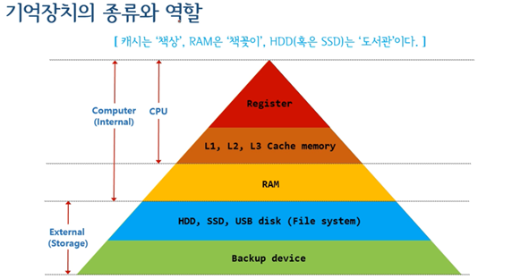
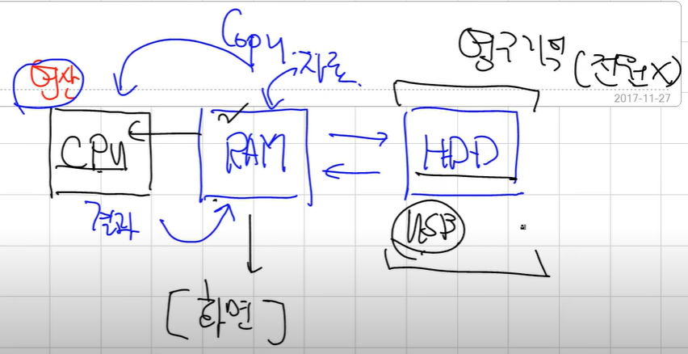
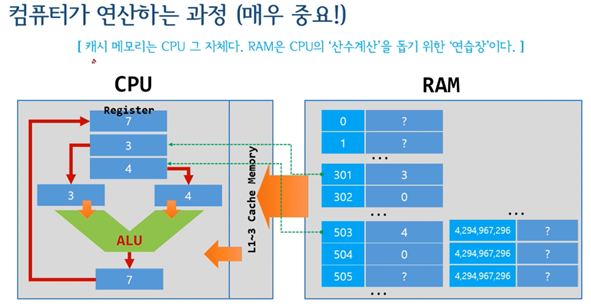

## 기억장치

 

기억장치 : 정보, 자료를 담아두는 공간
- 주기억장치, 보조기억장치로 나뉨
- 공간 마다 속도, 휘발성 다름

- 피라미드 꼭대기로 갈수록 속도가 빨라지고
- 피라미드 아래로 갈수록 저장용량이 늘어남(cpu(byte, mb), ram(gb), hd(tb) ...)
- cpu, ram은 주기억장치, 하드디스크는 보조기억장치

 

기억장치 흐름도

- CPU에서 연산 -> 연산을 위해 RAM 내 자료, 정보를 CPU에 가져와야 함 -> 연산 뒤 결과를 RAM에 보냄
- RAM은 보조기억장치 정보를 가져와서 CPU에 가져다 줌
- HDD가 정보를 빨리 가져오기 위해 캐시에서 가져옴
    - 캐시는 책의 목록같은 인덱스와 같다
- 연산은 레지스터에서 일어남 -> 연산 하기 위해서 RAM 이하의 정보를 CPU쪽으로 가져와야 함

 

- CPU가 RAM을 관리한다 

관리 체계
- 레지스터: 고유 이름
- 주기억장치: 일련번호
- 보조기억장치: 트랙번호, 섹터번호
 

트랙 + 섹터
- 하드디스크 정보 위치(몇 번 트랙, 몇 번 섹터의 A를 가져와라)
연산과정
- HDD의 1번 트랙 4번 섹터로 가서 그 안의 정보를 RAM으로 가져옴 -> 그 정보를 RAM메모리의 15번에 저장 -> 그 정보를 CPU내의 EAX레지스터에 가져와서 저장

### HDD의 논리적 구조(관리방법)

Format
- 아무것도 없는 곳에서 트랙과 섹터를 만들어서 집어넣는 과정 -> 포멧을 하게 되면 기존 정보가 다 날라감(관리체계가 바꼈기 때문)
- 포맷을 하게 되면 트랙과 섹터가 생겨남

FAT
- File Alocation Table(파일 할당 표)
- HDD가 파일을 찾기 위한 테이블표 -> 어떤 트랙 어떤 섹터에 있는지 정리한 표
- 정보가 각각 1트랙, 2트랙, 3트랙에 있으면 연속되지 않아 IO속도가 느려짐 -> 정보가 각각 1트랙 1,2,3섹터에 있으면 연속되어 IO속도가 빨라짐
- **디스크 조각모음**: 정보 조각들을 모아 연속된 공간에 저장하여 I/O입출력 속도를 빨라지게 하는 작업

### RAM 
- RAM은 1바이트(1 Byte) 단위로 데이터를 저장하며, 1byte마다 일련번호 주소를 가진다
- 이 위치정보로 데이터를 추적할 수 있다
- 32bit 기준 일련번호가 2의 32승인 42.9억개가 있음 -> 4GB ???

캐시 메모리
- CPU가 필요한 정보를 미리 가져옴
- 연산을 빠르게 하기 위해 RAM에서 미리 캐시 메모리로 가져옴

CPU 연산
- 1. RAM(301번[정보]에서 가져옴)
- 2. Cache에서 가져옴
- 3. CPU내의 레지스터 A로 옯김
- 4. ALU 연산
- 5. 결과 레지스터에 들어감
- 6. 레지스터 정보를 메모리 어딘가로 옮겨감
  - 이런 한줄한줄 수행하는 것을 `코드`라고 한다
  - `CPU가 인식하는 코드` = 머신 코드 = `기계어 코드`
  - CPU 장치는 기계어 코드를 순차적으로 계속해서 계산하는 일을 함 -> 그 결과를 RAM이든 HDD든 저장

 

> [출처](https://www.youtube.com/watch?v=LMwVUzJQSdU&list=PLXvgR_grOs1BQCziQ_MpM877BdBxwbMzA&index=9)