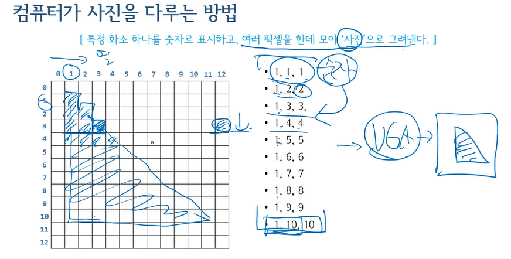

## 숫자로 글자와 사진을 다루는 법

컴퓨터 안에 존재하는 모든 것(정보)은 `숫자`다. -> 2진수

### ASCII 코드
- `표준 코드체계`
- 코드체계: 특정 숫자를 특정 글자로 사상하는 방식이며 이를 `코드체계`라고 한다
- 숫자와 글자를 구별하지 않고 정보를 말할 때는 `바이너리`라고 한다

### 컴퓨터가 사진을 다루는 방법
- 특정 화소 하나를 숫자로 표시하고, 여러 픽셀을 한데 모아 '사진'으로 그려낸다
- 모니터 화면 상 '점'하나를 **화소**라고 한다
- 화소 하나 표현하는데 8비트, 16비트, 24비트, 32비트 정보가 필요할 수 있다
- 빛의 3원색은 Red, Green, Blue이다. 이점에 착안해 RGB 컬러가 등장한다
- 화소가 작을 수록 사진이 매끄럽다 (고해상도)

- 1,1,1은 1열 1행 점1을 의미
- 이런 식의 정보들을 VGA카드에게 주면 VGA가 정보들을 토대로 모니터 화면에 보여줄 수 있다
- 이것 말고도 얼마든지 다른 규칙을 만들 수 있다

결론
- 컴퓨터 안에 존재하는 모든 것을 0과1로 표현되지만 시각화하는 것은 모니터를 통해 보여줄 수 있다
- **렌더링**: 숫자를 글자와 사진으로 그려내는 것

> 출처: [자료영상](https://www.youtube.com/watch?v=C9NqEy7BBTA&list=PLXvgR_grOs1BQCziQ_MpM877BdBxwbMzA&index=11)